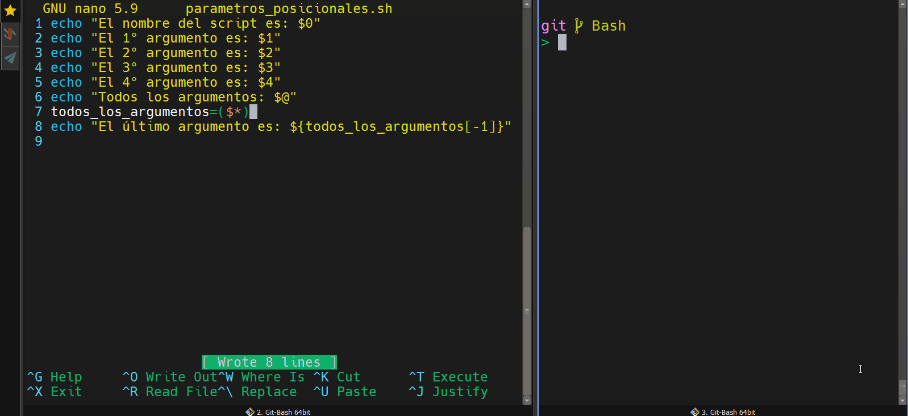

## Variables reservadas del shell

En un **script de bash**, hay una serie de variables son accesibles **en modo lectura**. Estas variables se inicializan por parte del shell y ofrecen imnformación de diversa índole.


### Parámetros posicionales

Los **scripts** en shell son capaces de recuperar los argumentos pasados por línea de comandos con la ayuda de las variables especiales, llamadas **parámetros posicionales**. Tenemos los siguientes parámetros posicionales: 

- **`$#`**: representa el número de argumentos recibidos por el script.
- **`$0`**: representa el nombre del script.
- **`$1,...,$9`**: la variable `$1` representa el valor del primer argumento, `$2` el valor del segundo y así hasta el `$9`. Bash y Ksh permiten usar las variables especiales `${10},${11},...`, las llaves son obligatorias cuando el nombre de la variable contiene más de una cifra.
- **`$*`** y **`$@`**: representa la lista de todos los argumentos (*menos `$0`*), la diferencia entre `$*` y `$@` se presenta en la programación

Ejemplos de usos:

```bash
echo "El nombre del script es: $0"
echo "El 1° argumento es: $1"
echo "El 2° argumento es: $2"
echo "El 3° argumento es: $3"
echo "El 4° argumento es: $4"
echo "Todos los argumentos: $@"
todos_los_argumentos=($*)
echo "El último argumento es: ${todos_los_argumentos[
-1]}"
```

