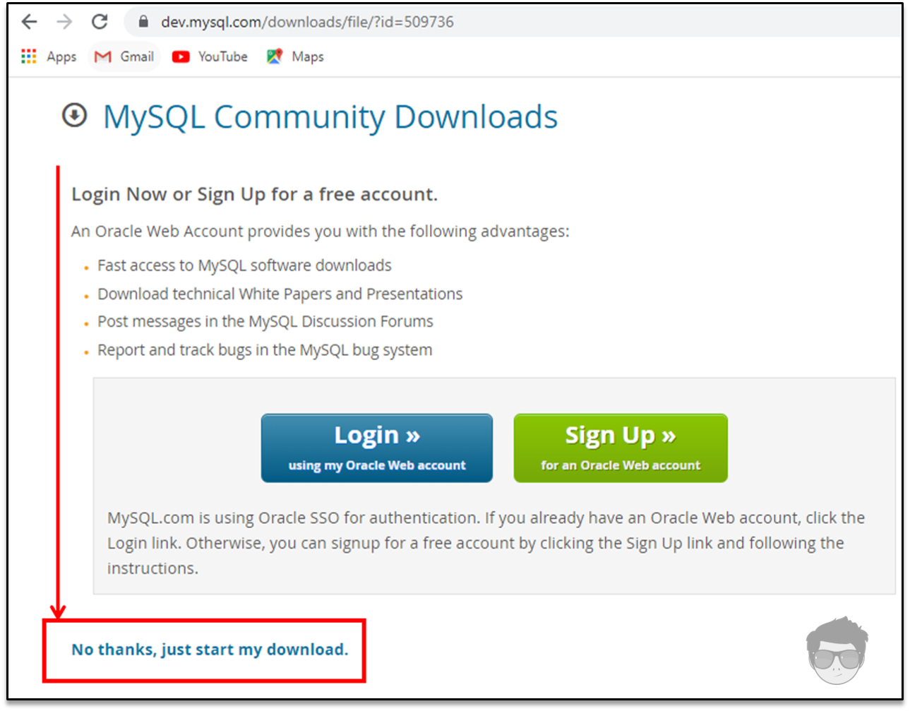

[comment]: <> (Author: Marco Contreras Herrera)
[comment]: <> (Email: enidev911@gmail.com)


# MySQL :rocket:

<a name="top"></a>
## Contenido

1. [Descarga y extrae los archivos.](#descarga)
1. [Archivos de opciones](#archivo-de-opciones)
1. [Inicializar servidor](#init)
1. [Primera conexión](#first_connect)
1. [Establecer contraseña](#change_password)
1. [Configurar MySQL como un servicio](#install_as_service)

---

<br>

<a name="descarga"></a>
## DESCARGAR ARCHIVO ZIP &#x25b6; [aquí](https://dev.mysql.com/downloads/file/?id=509736)

Ya esta seleccionado el archivo, solo damos clic en donde está señalado en la siguiente ilustración y comenzará la descarga.


Comienza la decarga

Extraemos el contenido en el directorio deseado


[](#top)

---

<a name="archivo-de-opciones"></a>
## ARCHIVO DE OPCIONES

El archivo de opciones es la configuración que se utilizará para iniciar el servidor de base de datos MySQL.  
Si es necesario especificarle opciones al servidor durante su inicio, esto también puede hacerse desde la línea de comandos pero es conveniente colocarlas en un archivo.  

Esto es especialmente necesario en las siguiente circuntancias:

1. El directorio de instalación o de datos son diferentes de los usados por defecto, Por ejemplo:  
    - C:\Program Files\MySQL\MySQL Server 8.x  
    - C:\Program Files\MySQL\MySQL Server 8.x\data

1. Es necesario afinar la configuración del servidor.  

Los parámetros declarados dentro del archivo de opciones son leidos como la configuración para iniciar el servidor de base de datos MySQL.  
El archivo dentro tiene una sección o directiva exclusiva para el servidor **`[mysqld]`** donde se puede definir la siguiente información: 

- **basedir**: el directorio base de instalación.  
(En el ejemplo de esta guía el directorio base es **C:\\MySQL8**)  
- **datadir**: la ubicación del directorio de datos.  
(Este se crea por defecto dentro del directorio base de instalación cuando inicializamos por primera vez el servidor, por ende, es importante crear un archivo de opciones previamente para establecer donde queremos que se cree este directorio de datos).  

**Crear y editar un nuevo archivo de opciones**

Un archivo de opciones puede crearse y modificarse con cualquier editor de texto, como el bloc de notas lo importante es guardar el archivo como my.ini en el directorio raíz Ej: **C:\\MySQL8**.  

La modificación de este archivo conlleva el actualizar las configuraciones del servidor al iniciarse, por lo que cada vez que realicemos cambios en este archivo debemos detener el servidor e iniciarlo nuevamente una vez salvado los cambios. 

En la raíz de donde se descomprimieron los archivos, creamos un nuevo archivo de opciones


**Aquí está las opciones que tengo definidas en el archivo:**

```mysql.ini
[client]
port=3306
socket=/temp/mysql.shock

[mysqld]
basedir=C:/MySQL8
datadir=C:/data
port=3306
key_buffer_size=16M
max_allowed_packet=8M

[mysqldump]
quick
```

Aunque MySQL ya viene con valores predeterminado en la configuración inicial, nos bastaría con solo indicar los parámetros **basedir** y **datadir**.  

Los nombres de las rutas de acceso de Windows se especifican en los archivos de opciones mediante barras diagonales (hacia adelante) en lugar de barras diagonales inversas. Si usa barras invertidas, duplíquelas Ej:

```mysql
[mysqld]
basedir=C:\\MySQL8
datadir=C:\\data
```
>nota: Si la carpeta que hemos definidos para los datos no existe, la creará por nosotros, pero si debe existir el destino de ruta que hemos indicado.

[](#top)

---

### <a name="init"></a>&#9875; INICIALIZAR EL SERVIDOR

Como hemos apreciado el paquete ZIP no incluye un directorio **data**. Para inicializar una instalación de MySQL, en caso de que no hayamos creando el archivo de opciones, se creara un directorio **data** dentro del directorio de instalación y dentro de ese directorio se crearan las bases de datos del sistema llenando las tablas del sistema MySQL. 

Usando el siguiente comando para inicializar el servidor:

```mysql
mysqld --initialize o --initialize-insecure.
```

**Este comando hace lo siguiente:** 

- Incializa el directorio de datos de MySQL y crea las tablas del sistema.
- Instala el esquema [sys](https://dev.mysql.com/doc/refman/8.0/en/sys-schema.html)
- Crea una cuenta administrativa.

**Implementación segura por defecto**

- Se crea una sola cuenta administrativa **'root'@'localhost'** con una contraseña generada aleatoriamente, que se marca como caducada.
- No se crean cuentas de usuario anónimo.
- No se crea ninguna base de datos como **test** accesible para todos los usuarios.
- La opción **`--random-password-file`** está disponible para controlar dónde se escribe la contraseña aleatoria.


<p align="center">
  <br>
  <b>Esto puede tardar unos segundos o minutos</b><br>
  <br>
  <b>Ahora corremos el servidor</b>
</p>

Al permitir el acceso del firewall del sistema, nos debe mostrar el siguiente mensaje al ejecutarse.

<p align="center">
  
</p>

La opción `--console` es para ver el [log](https://es.wikipedia.org/wiki/Log) en la línea de comandos y nos debe indicar que se encuentra listo para recibir conexiones entrantes.

En nuestro caso especificamos el destino para las bases de datos del sistema y el resto en **`C:\data`** si no la encuentra la crea y almacena el contenido. Si desea utilizar un directorio de datos en una ubicación diferente, debe copiar todo el contenido del directorio data en la nueva ubicación. Por ejemplo, si desea utilizarlo **`C:\mydata`** como directorio de datos, se puede hacer de dos formas:

1. Mueva todo el directorio data y todo su contenido desde la ubicación predeterminada. Por ejemplo **`C:\Path\installation\data`** a **`C:\mydata`** y luego detiene el servidor, realiza los cambios en el archivo de opciones y se vuelve a iniciar el servidor.

2. Utilizar la opción `--datadir` para especificar la nueva ubicación del directorio de datos cada vez que inicie el servidor. Ej:

```mysql
mysqld --datadir 'path\your\data'
```

<p align="center">
	
</p>

[](#top)

---

### <a name="first_connect"></a>&#9875; PRIMERA CONEXIÓN

Independiente de la configuración que hemos dado para conectarnos al servidor, primero que nada debemos inicializarlo, y luego conectarnos como clientes, dentro de la carpeta **data** se encuentra un archivo llamado con el nombre de tu equipo y la extensión `.err` abrimos ese archivo con el bloc de nota y buscamos el password generado para el usuario root de manera temporal:

<p align="center">
  <br>
  Abrimos el archivo con extensión .err<br>
  <br>
  Copiamos el password<br>
  
</p>

Ahora la primera tarea antes de comenzar a manipular bases de datos, será cambiar el password de nuestro usuario root. De hecho si intentamos ejecutar un comando sql nos va a requerir esta acción ya que el password generado con la inicialización tiene el estado de caducado.

<p align="center">
  
</p>


[](#top)

---

### <a name="change_password"></a>&#9875; ESTABLECER UNA NUEVA CONTRASEÑA


La declaración **`ALTER_USER`** modifica las cuentas de MySQL. Permite modificar las propiedades de autenticación, SSL/TLS, límite de recursos y administración de contraseñas para las cuentas existentes. 

Para cada cuenta afectada, **`ALTER USER`** modifica la fila correspondiente en la tabla `mysql.user` del sistema para reflejar las propiedades especificadas en el extracto. Las propiedades no especificadas conservan sus valores actuales.


```sql
ALTER USER USER() IDENTIFIED BY 'proPassword123';
```

Esta sintaxis permite cambiar su propia contraseña sin nombrar literalmente su cuenta. A continuación hemos dado un password al usuario root con el que nos conectamos la contraseña generada temporalmente por el servidor al momento de su instalación.

<p align="center">
  
</p>

Ahora recargamos los privilegios con: 

```sql
FLUSH PRIVILEGES;
```

Ahora ya podemos conectarnos con la nueva contraseña que hemos asignado, podemos consultar en la tabla de usuario el complemento de autenticación con el siguiente comando: 

```sql
SELECT user, plugin FROM mysql.user;
```

<p align="center">
  
</p>

Adicionalmente, podemos establecer esta ruta de donde lanzamos el servidor como variable de entorno para que nos resulte más comodo lanzar el servidor desde cualquier ubicación. Con el siguiente comando podemos establecer la ruta de instalación de MySQL a la variable **path** del usuario:


**En CMD**:

```bat
SETX PATH "%path%;"C:\MySQL8\bin\
```

**Para invocar a mysql en CMD o PowerShell**:

```bat
mysql -u root -p
```


Cerramos la ventana de comandos y abrimos una nueva.

[](#top)

---

### <a name="install_as_service"></a>&#9875; CONFIGURAR MYSQL COMO UN SERVICIO


Nos posicionamos dentro del directorio de instalación e ingresamos a la carpeta bin y ejecutamos los siguientes comandos. **Para llevar a cabo estos pasos es necesario abrir la sesión de CMD con privilegios de administrador**.


El siguiente comando es para asegurarte de no tener ninguna instancia del servidor corriendo actualmente.  
```
mysqladmin.exe -u root shutdown
```

El siguiente comando registra MySQL como servicio.  

```bat
:: Se registra con el nombre pasado como argumento.
:: De lo contrario solo con el nombre MySQL por defecto.
mysqld --install "MySQL8"
```

<p align="center">
	
</p>

Ahora ya podemos iniciar el servicio o detenerlo desde la línea de comandos, pero para llevar a cabo el proceso tenemos que abrir una nueva ventana como **administrador**.

**Iniciar el servicio con el comando net**
```
net start MySQL
```

**Detener el servicio con el comando:**
```
net stop MySQL
```

<p align="center">
  
</p>


**Eliminar el servicio**  
```
sc delete "MySQL"
```

[](#top)

---

<p align="center">
<!-- facebook -->
<a href="https://www.facebook.com/profile.php?id=100009064421475"></a>
<!-- github -->
<a href="https://github.com/EniDev911"></a>
<!-- twitter -->
<a href="https://twitter.com/MarcoContreraas"></a><br>
<!-- buymecoffe --><br>
<a href="https://www.buymeacoffee.com/9111592">
</a>
<!-- home --><br><br><br>
<a href="../../../../../README.md#mysql">
</a>
</p>