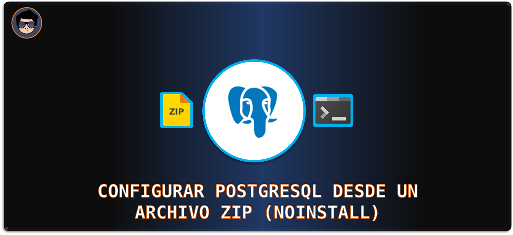
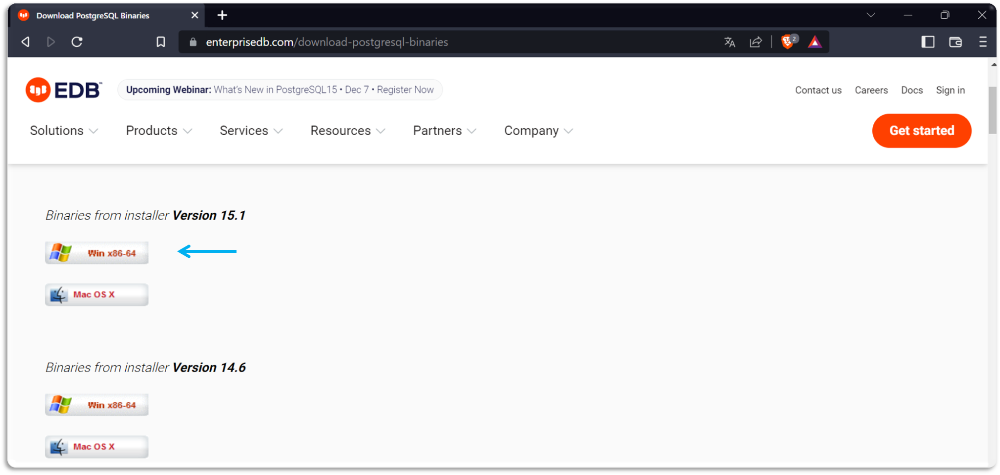
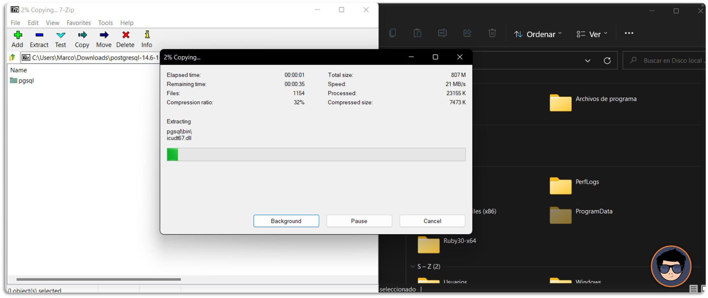
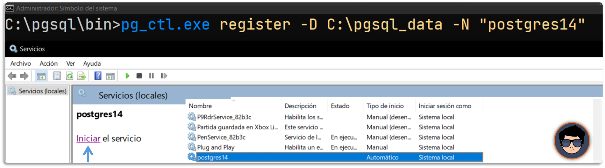
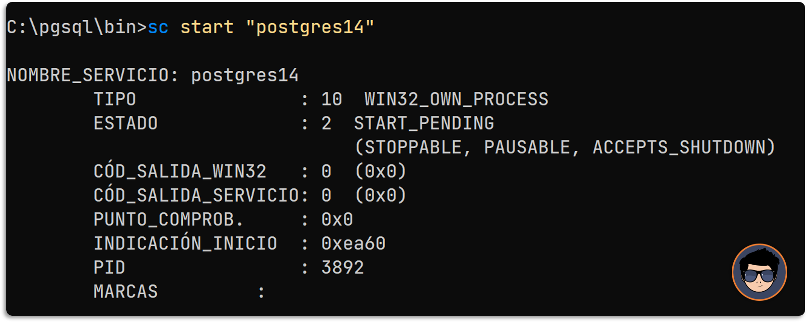

[comment]: <> (Author: Marco Contreras Herrera)
[comment]: <> (Email: enidev911@gmail.com)



<a name="top"></a>

## CONTENIDO

1. [Descargar el zip](#descargar-zip)
1. [Extraer el contenido](#extraer-archivos)
1. [Crear carpeta para las configuraciones](#crear-carpeta-data)
1. [Configuración inicial](#configuracion-inicial)
1. [Lanzar y detener el servidor](#lanzar-detener-servidor)
1. [Configurar PostgreSQL como un servicio](#registar-como-servicio)
1. [Agregar al PATH](#set-as-environ-var)
1. [Conectarse al servidor de PostgreSQL](#connect) 
1. [Operaciones básicas en psql](#operaciones-psql) 
 
---

<a name="descargar-zip"></a>
### Descargar binarios

Lo podemos descargar desde la siguiente web &#x25b6; [aquí](https://www.enterprisedb.com/download-postgresql-binaries).  
Selecciona alguna versión de acuerdo a la arquitectura y plataforma de tu computadora.



[](#top)

---

<a name="extraer-archivos"></a> 
### Extraer contenido

Extraemos los archivos en la siguiente ubicación &#x1f4c2; ➡ **C:\pgsql_14** (puedes elegir otro destino para descargar los archivos).





Otra forma es usar la herramienta **tar.exe** que se agrego a Windows 10 (1903) desde la compilación 17063 o posterior.  


```cmd
tar -xvf archivo-zip-postgresql.zip -C C:\
```


[](#top)

---

<a name="crear-carpeta-data"></a> 
### Crear carpeta data

Debemos crear una carpeta donde se almacenarán las configuraciones de nuestro servidor. También se guardarán los datos, usuarios, bases de datos, etc. En mi caso la voy a crear en el mismo nivel en la siguiente ubicación &#x1f4c2; ➡ **C:\pgsql_data**


> Tradicionalmente, los archivos de configuración y de datos usados por un clúster de base de datos se almacenan juntos dentro del directorio de datos del clúster (podemos utilizar el nombre de la variable de entorno  **PGDATA** para definir la ubicación del directorio de datos). La ubicación común en servidores en Linux es **/var/lib/pgsql/data**, los archivos de configuración `postgresql.conf`, `pg_hba.conf`, y `pg_ident.conf` del clúster se almacenan tradicionalmente en **PGDATA**, aunque es posible colocarlos en otro lugar.

[](#top)

---

<a name="configuracion-inicial"></a>
### Configuración inicial

Para iniciar una nueva configuración en un cluster de PostgreSQL y crear el **rol de superusuario**, **contraseña**, **encriptación**, y la **codificación** para las base de datos, haremos uso de la herramienta **initdb**.  

Nos cambiamos al directorio de instalación y entramos a la carpeta **bin**:  

```cmd
cd C:\pgsql_14\bin
``` 

Y ejecutamos el siguiente comando:

```cmd
initdb.exe -D C:\pgsql_data -U postgres -W -E UTF8 -A scram-sha-256
```
**Opciones**:

- **\-D**: especifique el directorio de almacenamiento del clúster de bases de datos **(C:\pgsql_data)**.
- **\-U postgres**: crea al superusuario como **postgres**.
- **\-W**: Nos solicitará la contraseña para el superusuario.
- **\-E UTF8**: crea la base de datos con codificación UTF-8.
- **\-A scram-sha-256**: habilita la autenticación de contraseña.  


> Para ver más opciones de **initdb** en este [artículo de la documentación](https://www.postgresql.org/docs/current/app-initdb.html) 

[](#top)

---

<a name="lanzar-detener-servidor"></a>
### Iniciar y detener el servidor de PostgreSQL

 
Para ver el estado del servidor y ver si se encuentra en ejecución o no:

```cmd
pg_ctl.exe -D C:\pgsql_data -l logfile status
```

Otra opción es usar:

```cmd
pg_isready.exe
```

Para iniciar el servidor:

```cmd
pg_ctl.exe -D C:\pgsql_data -l logfile start
```

Para detener el servidor:

```cmd
pg_ctl.exe -D C:\pgsql_data stop
```
Para reiniciar el servidor:

```cmd
pg_ctl.exe -D C:\pgsql_data restart
```
>Nota: cualquier acción con el servidor **es obligatorio indicar el directorio de datos**, al menos que se defina una variable de entorno **PGDATA** con el valor de la ubicación del cluster de datos.

[](#top)

---

<a name="registar-como-servicio"></a>
### Registrar como servicio en windows

Para ejecutar este comando debe abrir un CMD como **administrador**: 
```cmd
pg_ctl.exe register -D C:\pgsql_data -N "postgres14"
```



Para iniciar el servicio en un CMD como **administrador**:

```cmd
sc start "postgres14"
```




Para eliminar el servicio primero debemos detener el servicio **abrimos una sesión CMD como administrador** y ejecutamos el comando: 

```cmd
sc stop postgres14
```

Ahora ya podemos eliminar el servicio con el siguiente comando: 

```cmd
sc delete postgres14
# o también
pg_ctl.exe unregister -N postgre14
```


[](#top)

---

### <a name="set-as-environ-var"></a> Agregar al Path
    
Para ejecutar después el programa cliente psql desde cualquier ubicación, agregamos esa ubicación a la variable de entorno **PATH**.


También puede a través de un CMD normal (para que sea disponible para nivel de usuario) o como administrador (para que sea disponible a nivel de sistema): 

```cmd
setx PATH "%path%;"C:\pgsql_14\bin\
```

    
[](#top)

---

<a name="connect"></a>
### Conectarse al servidor


### Iniciar sesión en el servidor PostgreSQL

Usando el cliente **psql.exe** para conectarnos a nuestro servidor. Lo siguiente es llamar al programa e iniciar sesión indicando el usuario y luego nos pedirá el password.  
```cmd
psql -U postgres
```

Cuando se le solicite la contraseña, ingrese la contraseña que configuró durante la instalación. El prompt nos indica que estamos conetado con éxito y listo para realizar sentencias SQL.  


[](#top)

---

<a name="operaciones-psql"></a>
### Operaciones básicas en psql


- Para listar los usuarios, use el comando **`\du`**
- Para enumerar todas las bases de datos, use el comando **`\list`** o **`\l`**. 
- Para salir solo escribimos **`exit`** o **`\q`**.
- Para cambiar a una nueva base de datos, use el comando **`\connect <database>`** o **`\c <database name>`**. 
- Para mostrar tablas de una base de datos, use el comando **`\dt`** o **`\dt+`**.
- Para realizar una copia de seguridad o un volcado de la base de datos, use el comando:  
    **`pg_dump.exe -U postgres -d <database name> -f <path>\backup.sql`**
- Para importar un archivo `.pgsql` o `.sql` existente al servidor de la base de datos, use el siguiente comando.  
**`psql.exe -h <hostname> -U postgres < <path>\backup.sql`**

[](#top)


