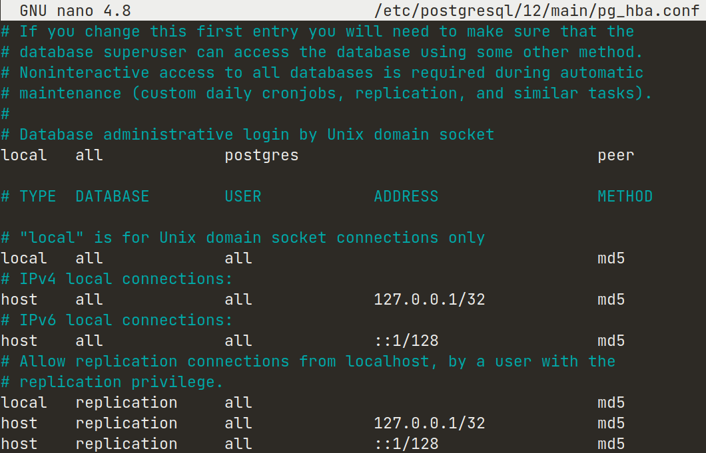

[comment]: <> (Author: Marco Contreras Herrera)
[comment]: <> (Email: enidev911@gmail.com)
[format]: <> (https://kramdown.gettalong.org/syntax.html#images)


## INSTALACIÓN Y CONFIGURACIÓN


<picture>
  <source media="(prefers-color-scheme: dark)" srcset="https://user-images.githubusercontent.com/25423296/163456776-7f95b81a-f1ed-45f7-b7ab-8fa810d529fa.png" width="30">
  <source media="(prefers-color-scheme: light)" srcset="https://user-images.githubusercontent.com/25423296/163456779-a8556205-d0a5-45e2-ac17-42d089e3c3f8.png" width="30">
  
</picture>


- [Cambiar a cuenta de postgres](#cambiar-a-postgres)
- [Crear un rol](#crear-un-rol)
- [Crear una nueva base de datos](#crear-nueva-basedatos)
- [Cambiar el método de autenticación a través del archivo pg_hba.conf](#cambiar-metodo-autenticacion)


Instalar los paquetes de PostgreSQL desde los repositorios predeterminados de Ubuntu. Para ello es necesario actualizar el índice de paquete:  

```bash
sudo apt update
```

Luego, podemos instalar el paquete de Postgre junto al paquete **postgresql-contrib**, que agrega algunas utilidades y funcionalidades adicionales:  

```bash
sudo apt install postgresql postgresql-contrib
```

Ahora que tenemos el software instalado, podemos analizar su funcionamiento. Por defecto, Postgres utiliza el concepto de "**roles**" para gestionar la autenticación y la autorización. Este aspecto es similar a las cuentas normales de estilo Unix, pero Postgres no distingue entre los usuarios y los grupos, y es por ello que prefiere usar el término más flexible como lo es "**rol**".

Postgres se configura por defecto para usar la autenticación *ident*. Esto significa que asocia los roles de Postgres con una cuenta de sistema Unix o Linux correspondiente. 

En el proceso de instalación Postgres creó una cuenta de usuario llamada **postgres, que se asocia con el rol predeterminado de Postgres**. Para comenzar a usar Postgres, podemos iniciar sesión en esa cuenta. Existen varias maneras de usar esta cuenta para acceder a Postgres.


<a name="cambiar-a-postgres"></a>
### Cambiar a la cuenta de postgres

En el siguiente comando vamos a ver dos formas de cambiarnos a la cuenta de *postgres*:


```bash
# una forma
sudo -i -u postgres
# otra forma 
sudo su postgres
```

Ahora, podemos acceder al servidor de Postgres invocando al cliente de línea de comandos **psql**: 

```bash
psql
```

También se puede ejecutar el comando con la cuenta de **postgres** de forma directa a través de **sudo**:  

```bash
sudo -u postgres psql
```

Esto nos permitirá iniciar sesión de forma directa en Postgres sin el shell **bash** intermediario entre ellos.

Para salir de la sesión interactiva de Postgre, ejecutamos el meta comando: 

```bash
\q
```

---


<a name="crear-un-rol"></a>
### Crear un rol

En este momento, solo tenemos el rol de **postgres** configurado dentro de la base de datos. Podemos crear nuevos roles a partir desde la línea de comandos usando la herramienta **`createrole`** y le indicamos la opción `--interactive` para que nos solicite el nombre del nuevo rol y también nos preguntará si debería tener **permisos de superusuario**.

```bash
createuser --interactive
```

Si, como alternativa podemos usar **sudo** para cada comando sin dejar de usar nuestra cuenta normal:  

```bash
sudo -u postgres createuser --interactive
```

Podemos ver más opciones adicionales de esta herramienta **`createuser`**:

```bash
man createuser
```

---


<a name="crear-nueva-basedatos"></a>
### Crear nueva base de datos

Otra susposición que el sistema de autenticación de Postgres realiza por defecto es que para cualquier rol creado para que pueda iniciar sesión deberá existir una base de datos con el mismo nombre del rol.

Esto significa que, si el usuario que desea acceder a Postgres con un rol llamado **boba-fett**, ese rol intentará conectarse con una base de datos, que por defecto, también se debe llamarse **boba-fett**. De lo contrario obtendremos un error por intentar acceder a una base de datos que no existe.

Podemos crear la base de datos apropiada usando la herramienta **`createdb`**.


```bash
createdb boba-feet
```


Para iniciar sesión con la autenticación basada en *ident*, necesitaremos un usuario de Linux con el mismo nombre del rol y su base de datos de Postgres.

Podemos crear un usuario en Linux con el comando `adduser`,  Debe tener privilegios **sudo** para ejecutar el comando: 

```bash
sudo adduser boba-fett
```

Ahora nos deberá solicitar crear un password para el nuevo usuario, una vez se establece podemos iniciar sesión usando el siguiente comando:

```bash
su boba-fett
```

Nos pedirá la constraseña que establecimos anteriormente, iniciada la sesión ahora simplemente podemos invocar a **psql**:

```bash
psql
```

---

<a name="cambiar-metodo-autenticacion"></a>
### Cambiar el método de autenticación




---

[](https://www.buymeacoffee.com/9111592)