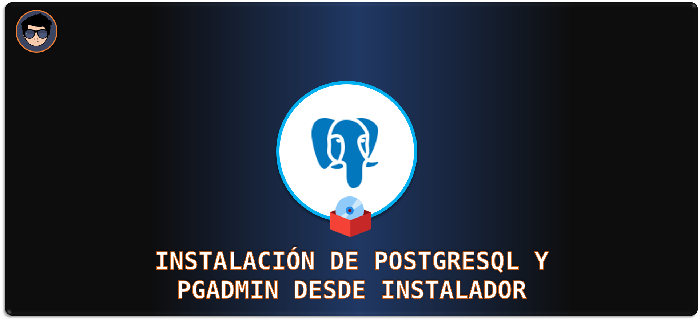
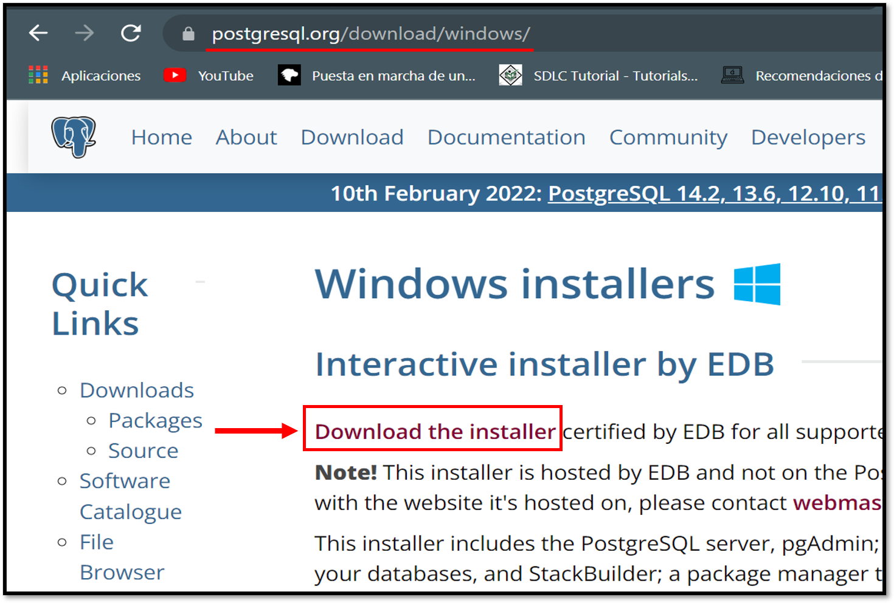
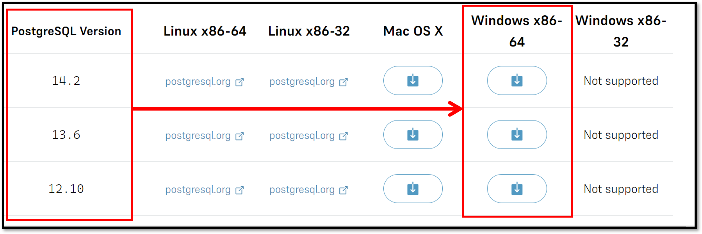
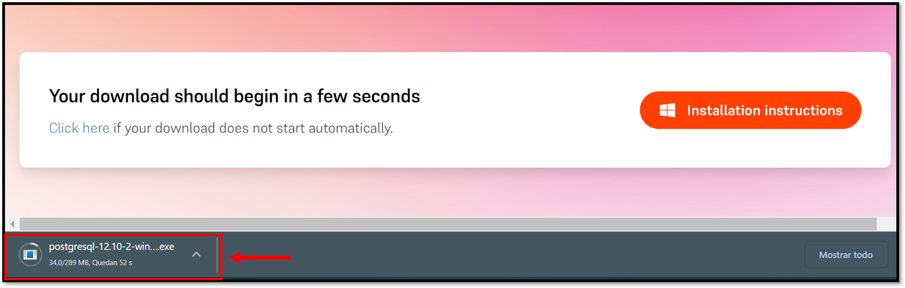
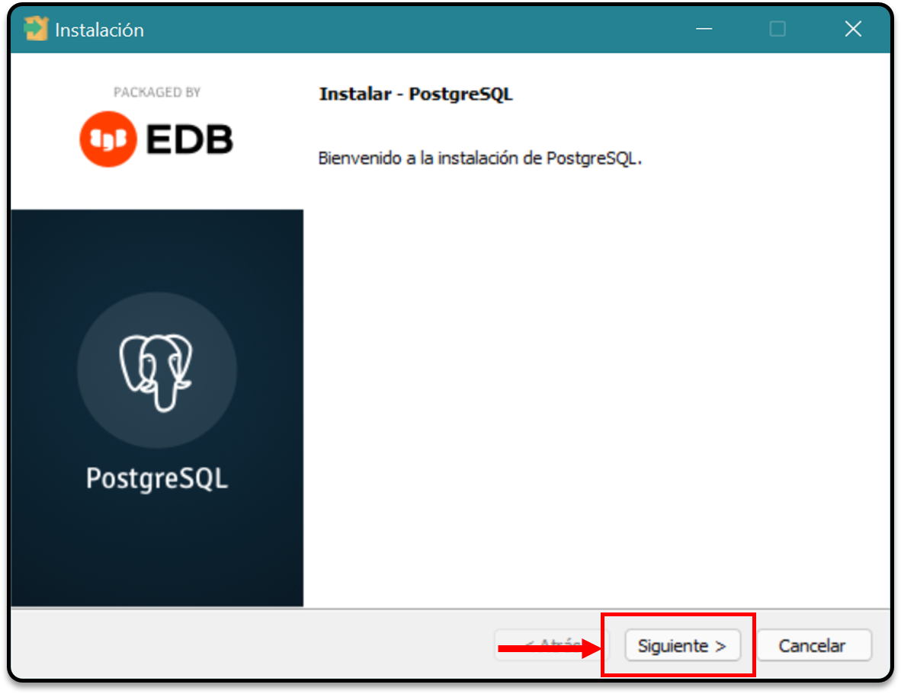
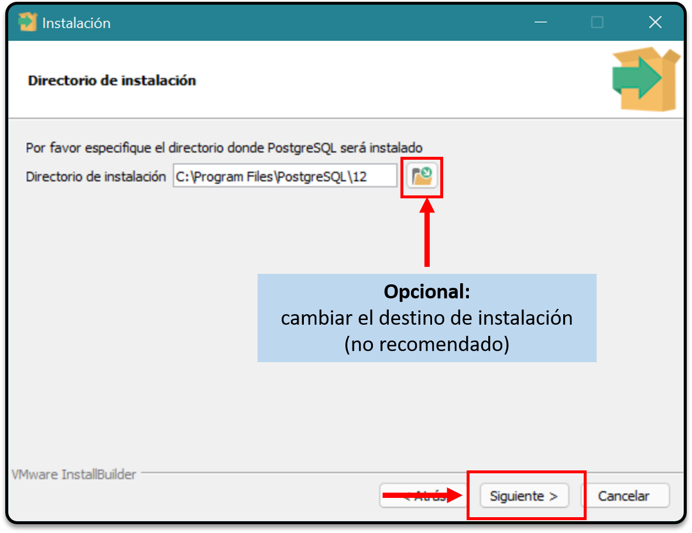
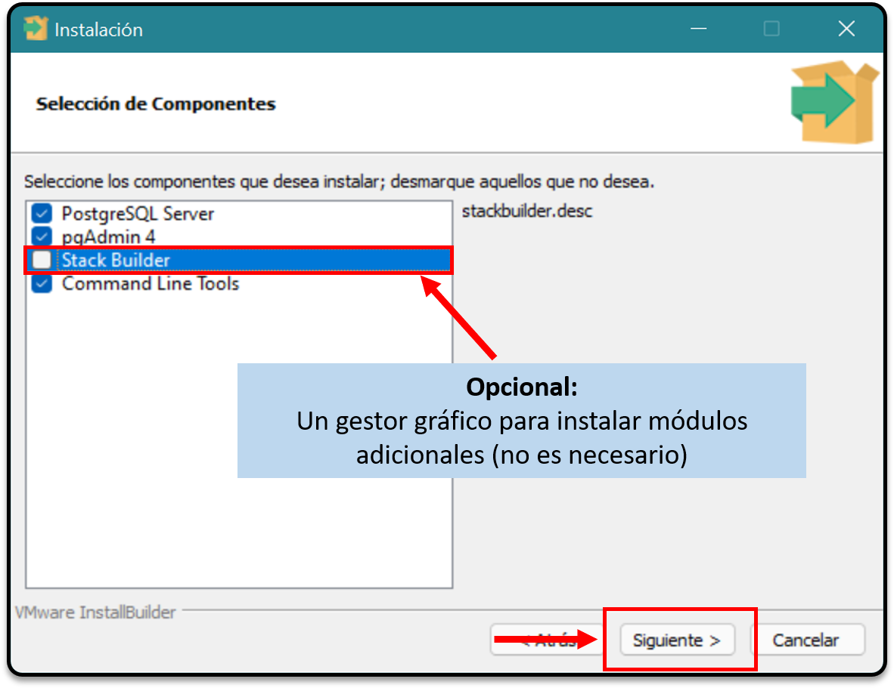
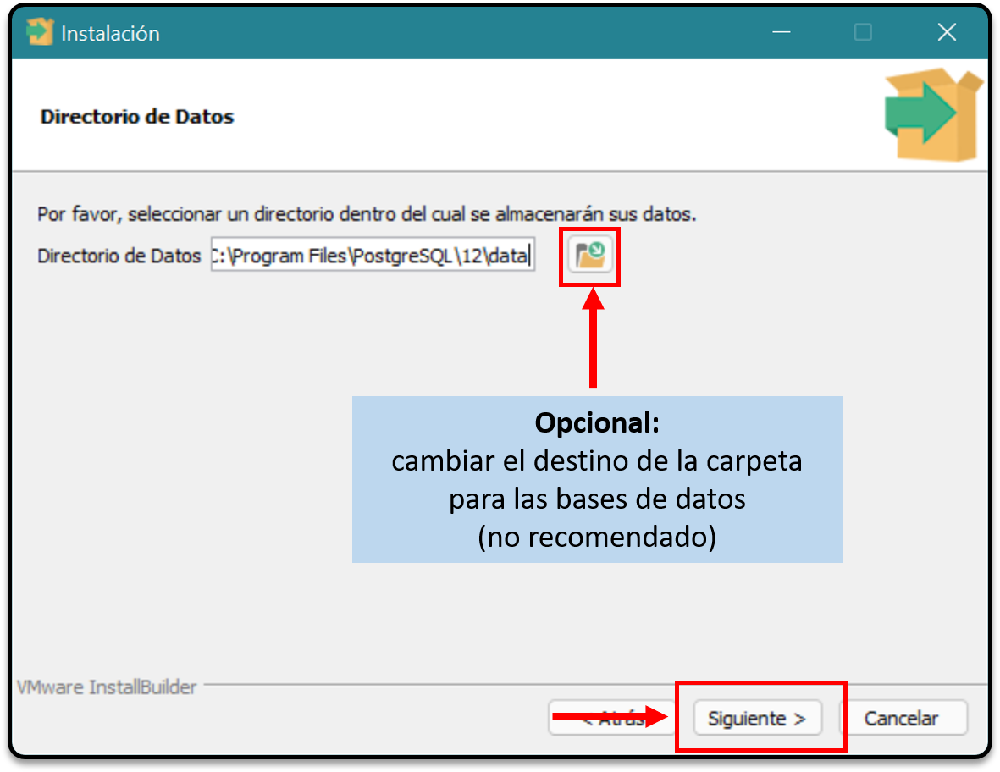
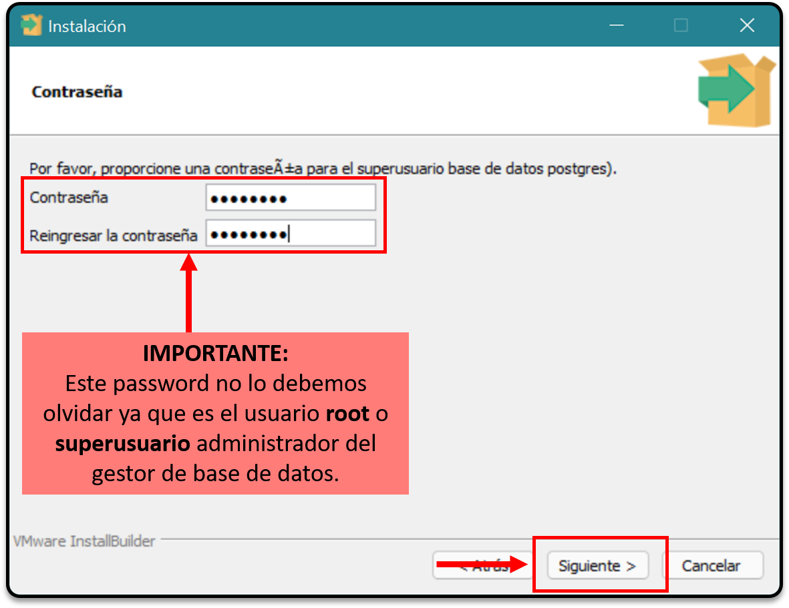
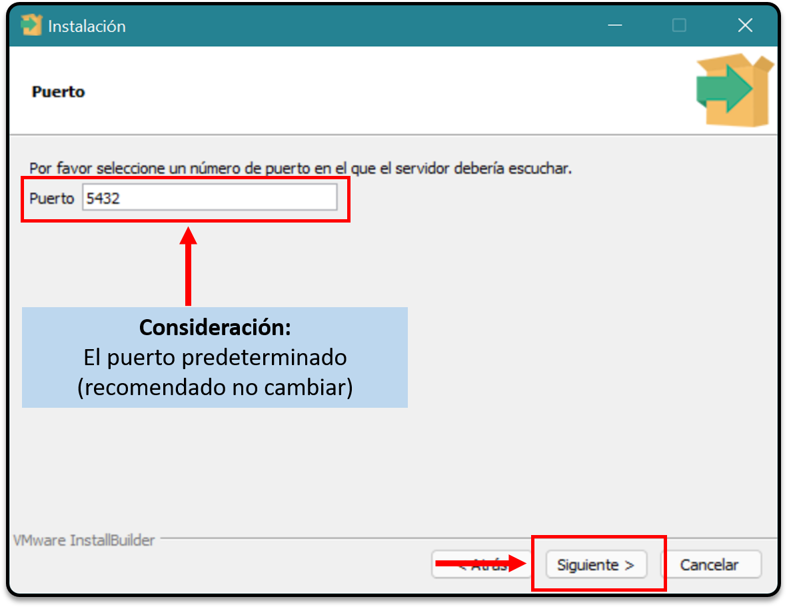

[comment]: <> (Author: Marco Contreras Herrera)
[comment]: <> (Email: enidev911@gmail.com)

## CONTENIDO

1. [Descargar instalador](#descargar)
1. [Ejecutar el instalador](#ejecutar-instalador)
1. [Crear carpeta para las configuraciones](#crear-carpeta-data)
1. [Configuración inicial](#configuracion-inicial)
1. [Lanzar y detener el servidor](#lanzar-detener-servidor)
1. [Configurar PostgreSQL como un servicio](#registar-como-servicio)
1. [Agregar al PATH](#agregar-al-path)
1. [Conectarse al servidor de PostgreSQL](#connect) 
1. [Operaciones básicas en psql](#operaciones-psql) 
 
---

### Descargar instalador

El instalador para postgres lo podemos descargar desde la siguiente web &#x25b6; <a href="https://www.postgresql.org/download/windows" target="_blank">AQUÍ</a>.  

    

Selecciona alguna versión de acuerdo a la arquitectura y plataforma de tu computadora.

    

    

---

 
### Ejecutar el instalador

Vamos a la ubicación de las descargas &#x1f4c2; ➡ **C:\Users\<su-usuario\>\Downloads\posgresql-<su-version\>.exe** y ejecutamos el instalador y seguimos las instrucciones:  

    

    

    

    

    

    

