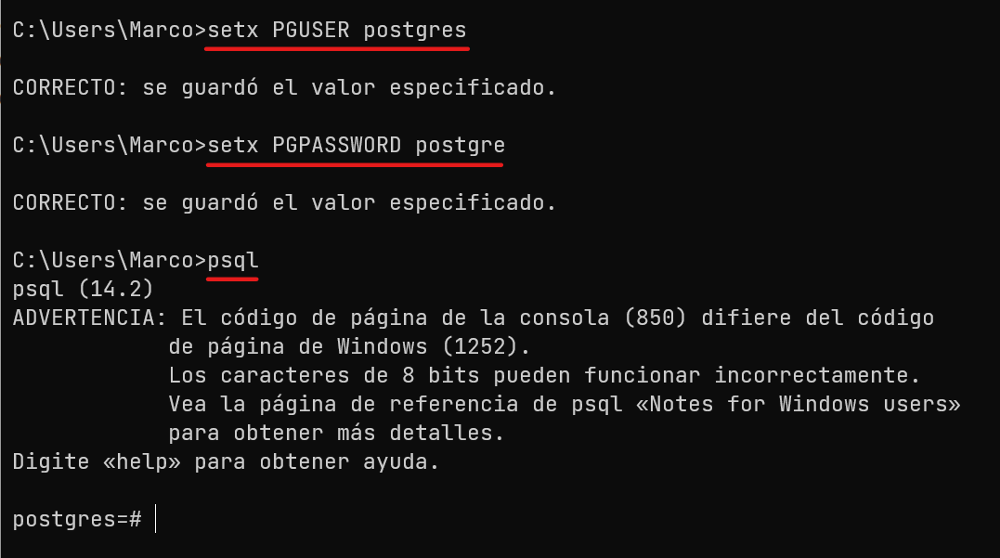
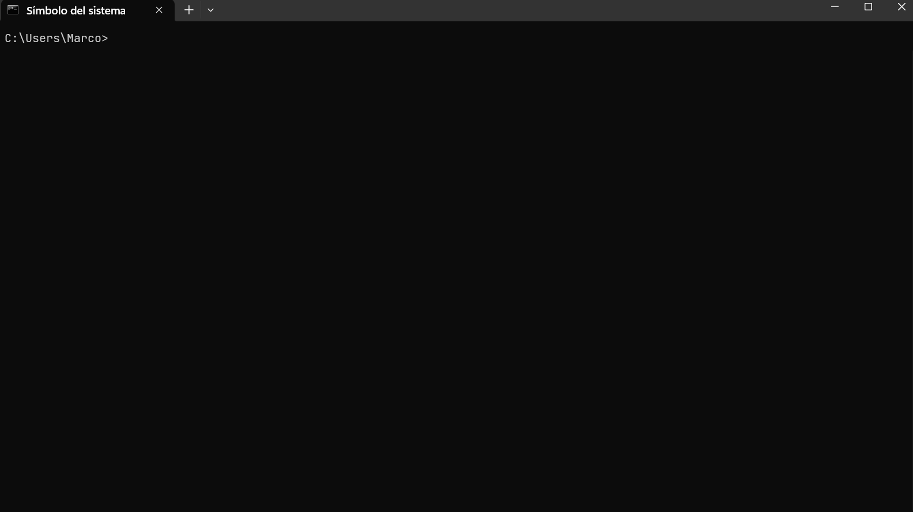
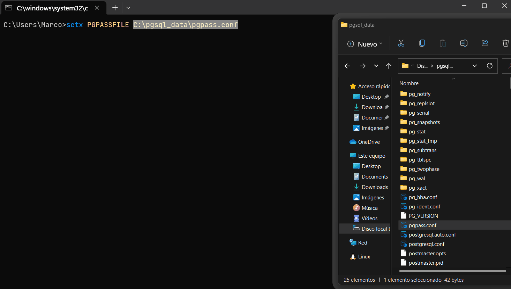
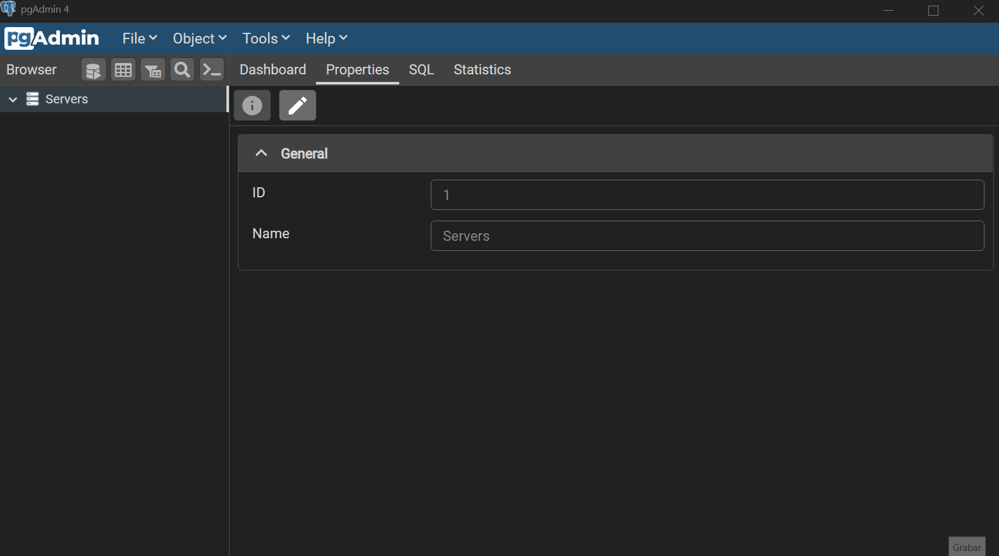
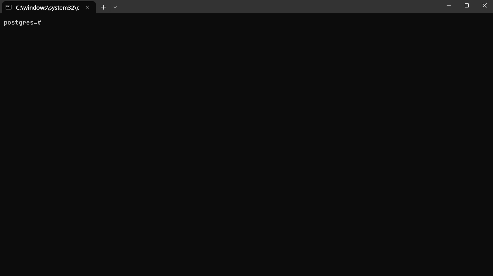
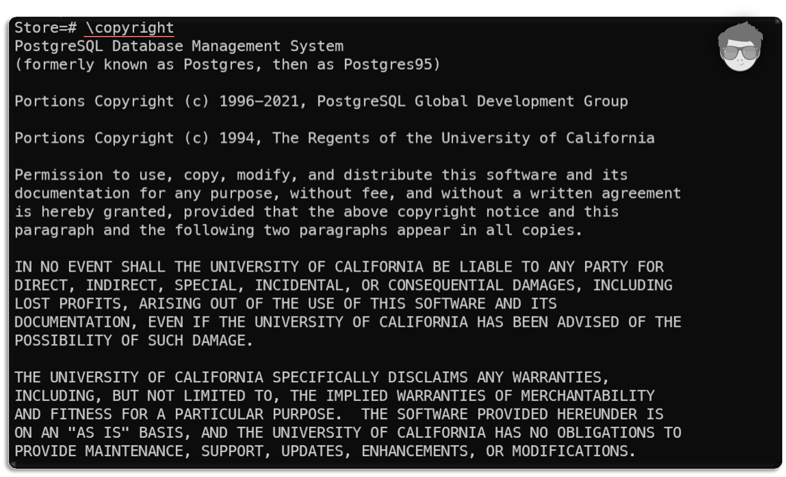
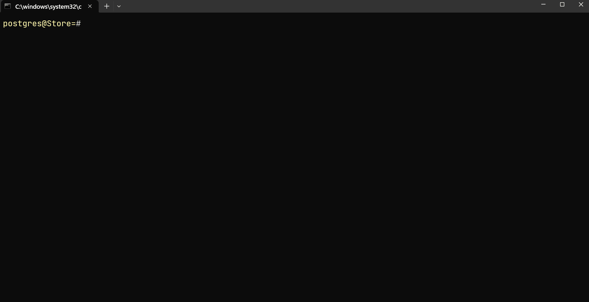
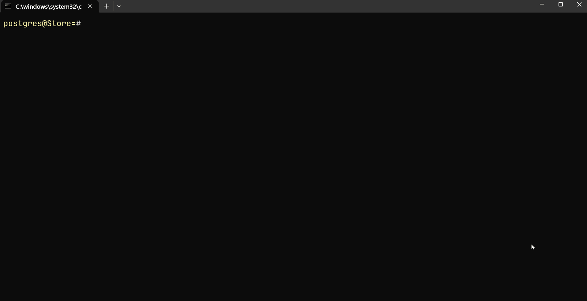

[comment]: <> (Author: Marco Contreras Herrera)
[comment]: <> (Email: enidev911@gmail.com)

## CLIENTE DE LÍNEA DE COMANDOS


<picture>
  <source media="(prefers-color-scheme: dark)" srcset="https://user-images.githubusercontent.com/25423296/163456776-7f95b81a-f1ed-45f7-b7ab-8fa810d529fa.png" width="30">
  <source media="(prefers-color-scheme: light)" srcset="https://user-images.githubusercontent.com/25423296/163456779-a8556205-d0a5-45e2-ac17-42d089e3c3f8.png" width="30">
  
</picture>

<a href="top"></a>
## CONTENIDO

- [Introducción](#intro)
- [Opciones en línea de comandos](#opciones-en-linea-de-comandos)
- [Establecer variables de entornos con valores de conexion](#variables-de-conexion)
- [Establecer conexión en formato de URI](#formato-uri-conexion)
- [Archivo de contraseñas **pgpass**](#archivo-pgpass)
- [Meta comandos](#meta-comandos)
- [Interpolación SQL](#interpolar-sql)
- [Opciones para el prompt](#optionsprompt)

---

### <a name="intro"></a> INTRODUCCIÓN

**Psql** es una aplicación cliente que viene incluido en el paquete de PostgreSQL regular y está basado en la terminal. Nos permite establecer una conexión a un servidor de PostgreSQL donde debemos proporcionar las opciones de conexión como **argumentos** correctamente a través de la línea de comandos, establecida la conexión se abre una sesión interactiva para realizar consultas [**`SQL`**](https://es.wikipedia.org/wiki/SQL) y enviarlas a nuestro servidor de PostgreSQL y ver los resultados. Además, psql proporciona una serie de [**`matacomandos`**](#metacommand) y varias funciones similares a las de un shell para facilitar la escritura de scripts y la automatización de una amplia variedad de tareas.


---


<a name="opciones-en-linea-de-comandos"></a>
### Opciones en línea de comandos

Para conectarse al servidor, necesita saber el **nombre de la base de datos de destino**, **el nombre de host**, **nombre de usuaurio**, **puerto del servidor**, etc..., y con que **nombre de usuario** desea conectarse. Se puede informar a **psql** sobre esos parámetros a través de las **opciones de la línea de comandos** `-d`, `-h`, `-U`, `-p` respectivamente.

Ej: conectarse a postgres con el usuario ***postgres***, al host ***localhost***, y a la base de datos ***postgres***  

```cmd
psql -h localhost -U postgres -d postgres
```

Si se encuentra un argumento que no pertenece a ninguna opción, se interpretará como el nombre de la base de datos (o el nombre de usuario, si el nombre de la base de datos ya está dado). **No todas estas opciones son obligatorias; hay valores predeterminados** útiles. Por ejemplo:

- Si omite el nombre de host, psql se conectará a través de un socket de dominio Unix a un servidor a un host local, o a través de TCP/IP a **localhost**. 

- El número de puerto predeterminado se determina en tiempo de compilación. Dado que el servidor de la base de datos utiliza el mismo valor predeterminado **5432**, no se tendrá que especificar el puerto en la mayoría de los casos. 

- El nombre de usuario predeterminado es el nombre de usuario de su sistema operativo, al igual que el nombre de la base de datos predeterminada. 

<details>
  <summary>Clic ver demo 🖱️</summary>
  
</details><br>

> NOTA: Tengamos en cuenta que no se puede simplemente conectarse a cualquier base de datos con cualquier nombre de usuario. El usuario que desea conectarse debe tener los permisos previamente creados por un usuario con rol de administrador o superusuario del sistema de base de datos.  

[](#top)

---

<a name="variables-de-conexion"></a>
### Estableciendo variables de entornos con valores de conexión

Cuando los valores predeterminado no son del todo correctos, puede ahorrarse algo de escritura configurando las siguientes variables de entorno:  


**`PGUSER`** : (windows cmd) 
```cmd
setx PGUSER postgres
```

**`PGPASSWORD`** : (windows cmd)
```cmd
setx PGPASSWORD postgre
```



> NOTA: Considere usar mejor un **archivo pgpass**

[](#top)

---


<a name="formato-uri-conexion"></a>
### Conexión en formato de URI

Una forma alternativa de especificar los parámetros de conexión es una cadena o un URI tipo `conninfo`, que se usa en lugar del nombre de una base de datos. Este mecanismo le da un control muy amplio sobre la conexión.

Un ejemplo sería:

```
psql postgresql://hostname:5432/mydb?user=username
```

<details>
  <summary>Clic ver demo 🖱️</summary>
  
</details><br>

[](#top)

---


<a name="archivo-pgpass"></a>
### Archivo de contraseñas

El archivo `.pgpass` se debe almacenar en el directorio de inicio de un usuario puede contener contraseñas que se utilizarán si la conexión requiere una contraseña (y si no se ha especificado ninguna contraseña). En Windows, el archivo se nombra en el directorio de datos `%APPDATA%\postgresql\pgpass.conf` (donde **`%APPDATA%`** se refiere al subdirectorio de Datos de la aplicación en el perfil del usuario). Como alternativa, el archivo de contraseñas que se utilizará se puede especificar mediante el parámetro de conexión passfile o la variable de entorno **PGPASSFILE**.

Este archivo debe contener líneas en el siguiente formato:

```txt
hostname:port:database:username:password
```

<details>
  <summary>Clic ver ejemplo estableciendo la variable PGPASSFILE en cmd Windows 🖱️</summary>
  
</details><br>

Podemos agregar un comentario en una línea precediéndola con un `#`. Cada uno de los primeros cuatro campos puede ser un valor literal, o un comodín `*` para que coincida con cualquier cosa y de esa manera no nos solicite ingresar credenciales para conectarnos a otra base de datos o desde un cliente como **pgadmin** que nos muestra un mensaje de error al proporcionar valores literales.

Un ejemplo sería:  

```text
# hostname:port:database:username:password
localhost:5432:*:postgres:postgre
```

<details>
  <summary>Clic ver ejemplo agregando un archivo pgpass desde PgAdmin 🖱️</summary>
  
</details><br>

En los sistemas Unix, los permisos en un archivo de contraseña deben prohibir cualquier acceso al mundo o grupo; lograr esto mediante un comando como `chmod 0600 ~/.pgpass`. Si los permisos son menos estrictos que esto, el archivo se ignorará. En Microsoft Windows, se supone que el archivo se almacena en un directorio que es seguro, por lo que no se realizan comprobaciones de permisos especiales

---

<a name="meta-comandos"></a>
### Meta Comandos

Cualquier cosa que ingrese en psql que comience con una barra invertida **`\`** sin comillas es un meta-comando de **psql** que es procesado por psql mismo. Estos comandos hacen que **psql** sea más útil para la administración o la creación de scripts.

<table>
  <thead>
    <th align="left">Comando</th>
    <th align="left">Descripción</th>
  </thead>
  <tbody align="left">
    <tr>
      <th>
        <a href="#mc-a">
        <code><b>\a</b></code>
        </a>
      </th>
      <th>
        <a href="#mc-a">Activa o Desactiva el formato alineado de la tabla.</a>
      </th>
    </tr>
    <tr>
      <th>
        <a href="#mc-connect">
          <code>\c [params]</code>
        </a>      
      </th>
      <th>
        <a href="#mc-connect">
          Establece una nueva conexión a un servidor PostgreSQL.
        </a>
      </th>
    </tr>
    <tr>
      <th>
        <a href="#mc-title">
          <code>\C [title]</code>
        </a>
      </th>
      <th>
        <a href="#mc-title">
          Establece o Anula el título de las tablas que se imprimen en los resultados de una consulta.
        </a>
      </th>
    </tr>
    <tr>
      <th>
        <a href="#mc-cd">
          <code>\cd [<b>directory</b>]</code>
        </a>
      </th>
      <th>
        <a href="#mc-cd">
          Cambia el directorio de trabajo actual a <code><b>directory</b></code>. Sin argumentos, cambia el directorio de inicio del usuario actual.
        </a>
      </th>
    </tr>
    <tr>
      <th>
        <a href="#mc-conninfo">
          <code>\conninfo</code>
        </a>
      </th>
      <th>
        <a href="#mc-conninfo">
          Muestra información sobre la conexión de base de datos actual.
        </a>
      </th>
    </tr>
    <tr>
      <th>
        <a href="#mc-copyright">
          <code>\copyright</code>
        </a>      
      </th>
      <th>
        <a href="#mc-copyright">
          Muestra información sobre los términos de licencia.
        </a>
      </th>
    </tr>
    <tr>
      <th>
        <a href="#mc-echo">
          <code>\echo [text]</code>
        </a>
      </th>
      <th>
        <a href="#mc-echo">
        Imprime los argumentos evaluados en la salida estándar, separados por espacios y seguidos de una nueva línea, si se coloca entre (<code>`</code>) se interpreta como un comando.  
        </a>
      </th>
    </tr>
    <tr>
      <th>
        <a href="#mc-timing">
          <code>\timing</code>
        </a>
      </th>
      <th>
        <a href="#mc-timing">
          Activa o Desactiva la visualización del tiempo en milisegundos que tarda cada instrucción SQL.
        </a>
      </th>
    </tr>
    <tr>
      <th>
        <a href="#mc-x">
          <code>\x</code>
        </a>
      </th>
      <th>
        <a href="#mc-x">
    Activa o Desactiva el formato de tabla expandido en el resultado de cada instrucción SQL o meta-comando.      
        </a>
      </th>
    </tr>
  </tbody>
</table>


|[**`\h o \help`** \[command\]](#mc-help)|[Brinda ayuda de sintaxis en el comando SQL especificado. Si **`command`** no se especificam psql enumerará todos los comandos para los que hay ayuda disponible. Si **`command`** es un asterisco (`*`), se muestra la ayuda de sintaxis en todos los comandos SQL.](#mc-help)|
|[**`\H - \html`**](#mc-html)|[Activa el formato de salida de consulta HTML. Si el formato HTML ya está activado, se vuelve al formato de texto alineado predeterminado. Este comando es por compatibilidad y comodidad, pero tenemos `\pset` para configurar otras opciones de salida.](#mc-html)|
|[`\!` \[command\]](#mc-command)|[Permite ejecutar comandos de la **shell de Linux** o de **CMD de windows** desde la propia consola de psql.](#mc-command)|
|[**`i o \include`** \[filename\]](#mc-include)|[Lee la entrada del archivo **filename** y la ejecuta.](#mc-include)|
|[`\l[+]` \[pattern\]](#mc-l)|[Muestra un listado de las bases de datos que existen en la instancia del servidor PostgreSQL junto a sus nombres, propietarios, juego de caracteres y privilegios de acceso. Si se especifica un "**pattern**", solo se listan las bases de datos cuyo nombre coincidan con el patrón. Si se agrega el símbolo "+", también se muestran los tamaños de las bases de datos, los tablespace y las descripciones.](#mc-l)|
|[`\s` \[filename\]](#mc-s)|[Imprime por consola o en un archivo "**filename**" si se especifica, un historial de los comandos utilizados.](#mc-s)|
|[**`\o - \out`** \[filename\]](#c-out)|[Permite guardar el resultado de las futuras consultas en el archivo "**filename**". El resultado incluye todas las tablas, respuestas de comandos y mensajes de tipo "notices" del servidor, pero no los mensajes de error.](#c-out)|


---

<a name="mc-a"></a>
**Meta Comando para alineación \\a**  

Si el formato de salida de la tabla no está alineado, se cambia a alineado. Este comando es mantenido por compatibilidad y comodidad, se puede utilizar **`\pset`** para una solución más general. Ej:



[](#meta-comandos)

---

<a name="mc-connect"></a>
**Meta Comando para  cambiar de conexión \\c**  

**Sintaxis**:

```txt
\c [ -reuse-previous=on|off ] [ dbname [ username ] [ host ] [ port ] | conninfo ]
```

Establece una nueva conexión a un servidor de PostgreSQL. Los parámetros de conexión se pueden especificar usando la sintaxis posicional o usando una cadena de conexión.


[](#meta-comandos)

---

<a name="mc-title"></a>
**\\C**  

Establece | Anula el título de las tablas que se imprimen en los resultados de una consulta.


[](#metacommand)

---

<a name="mc-copyright"></a>
**\\copyright**

Muestra los términos de copyright y distribución de PostgreSQL  



[](#metacommand)

---

<a name="mc-timing"></a>
**Timing**


[](#metacommand)

---

<a name="mc-extends"></a>

**Extend**  



[](#metacommand)

---

<a name="echo"></a>
**\\echo**  



[](#metacommand)

---

<a name="mc-html"></a>
**\\H**


[](#metacommand)

---

<a name="mc-conninfo"></a>
**\\conninfo**


[](#metacommand)

---


<a name="interpolar-sql"></a>
### Interpolación SQL

Una característica clave de las **variables en psql** es que pueden sustituirlas ("interpolarlas") en sentencias SQL normales, así como en los argumentos de los **meta-comandos**. Además psql proporciona funciones para garantizar que los valores de las variables utilizados como identificadores y literales de SQL se cite correctamente. La sintaxis para interpolar un valor sin comillas es anteponer dos puntos (`:`) al nombre de la variable. Por ejemplo:  

```psql
\set var 'usuarios'
SELECT * FROM :var;
```

consultaría la tabla con el valor `usuarios` asignada a la variable. Considerar que esto puede no ser seguro: el valor de la variable se copia literalmente, por lo que puede contener comillas no balanceadas o incluso comandos de barra invertida. Debemos asegurarnos de que el valor tenga sentido donde lo utilicemos.

Cuando se va a utilizar un valor como identificador o literal de SQL, lo más seguro es disponer que se incluya entre comillas. Para citar el valor de una variable como literal SQL, escriba dos puntos (`:`) seguidos del nombre de la variable entre comillas simples.  Para citar el valor como un identificador SQL, escriba dos puntos seguidos del nombre de la variable entre comillas dobles. Estas construcciones tratan correctamente las comillas y otros caracteres especiales incrustados en el valor de la variable. El ejemplo anterior se escribiría de manera más segura de esta manera:

```sql
\set var 'usuarios'
SELECT * FROM :"var";
```

La interporlación de variables no se realizará dentro de literales e identificadores de SQL entre comillas. Por lo tanto, una construcción como `':var'` no funciona para producir un literal entrecomillado a partir del valor de una variable (y no sería seguro si funcionara, ya que no manejaría correctamente las comillas incrustadas en el valor).

Un ejemplo de uso de este mecanismo es copiar el contenido de un archivo en una columna de tabla. Primero se carga el archivo en una variable y luego interpolamos el valor de la variable como una cadena entrecomillada:  

```sql
\set content `cat my_file.txt`
INSERT INTO my_table VALUES (:'content');
```


### <a href="personalizar-prompt"></a>


```
\set PROMPT1 '%[%033[1;33;40m%]%n@%/%R%[%033[0m%]%# '
```