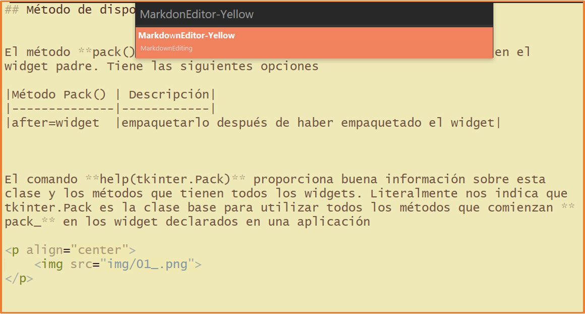

[comment]: <> (Author: Marco Contreras Herrera)
[comment]: <> (Email: marco.contreras.h90@gmail.com)


## EXTENSIONES PARA MARKDOWN


<picture>
  <source media="(prefers-color-scheme: dark)" srcset="https://user-images.githubusercontent.com/25423296/163456776-7f95b81a-f1ed-45f7-b7ab-8fa810d529fa.png" width="30">
  <source media="(prefers-color-scheme: light)" srcset="https://user-images.githubusercontent.com/25423296/163456779-a8556205-d0a5-45e2-ac17-42d089e3c3f8.png" width="30">
  
</picture>


<a name="top"></a>

## CONTENIDO

- [Instalar MarkdownEditing](#instalar-markdownediting)
- [Características de MarkdownEditing](#caracteristicas-markdownediting)
    * [Atajos de teclado](#key-binding)
- [Instalar MarkdownPreview](#markdown-preview)


<a name="instalar-markdownediting"></a>
### Instalar MarkdownEditing

Recien instalado, SublimeText no ofrece ningún soporte específico de Markdown, **sin resaltado de sintaxis y formato especial en cursiva o negrita, atajos de teclado** además **sin vista previa de salida HTML**.

Para agregar estas características debemos instalar algunos complementos *plugins* y configurar algunas preferencias siguiendo estos pasos:  


**.1** Abrimos **package control** (<kbd>Crtl</kbd>+<kbd>Shift</kbd>+<kbd>p</kbd>) luego escribimos **install** y seleccionamos la opción ***Install Package***


**.2** Escribir el nombre del paquete, en este caso tiene el nombre de ***MarkdownEditing***


**.3** Reinicia ***SublimeText***


>**Nota:** Posiblemente al instalarlo te encuentres con una ventana emergente de error como la siguiente:
  
Esto se debe que cuando se descarga la extensión te cargará automaticamente el archivo README.MD del mismo paquete instalado, por lo que de manera inmediata te arrojará este error, por otro lado, para poder evitar este mensaje de error es muy sencillo, vamos a buscar en la barra del menú debemos abrir **Preferences** =\> **Settings**, y quitamos Markdown de la lista en **"ignored_packages"** en las Preferencias del usuario:


Editamos `Preferences.sublime-settings -- User`:

```js
{
"ignored_packages":
  [
    "Markdown", // 👈 sacar de esta lista 
    "Vintage",
  ]
 }
```


Despues de reiniciar ***Sublimetext***, todas las funciones del paquete ***MarkdownEditing*** se aplicarán solo a los archivos con extensión **`.md y .markdown`**.


<a href="#top"></a>

---


<a name="caracteristicas-markdownediting"></a>
### Características de MarkdownEditing

El paquete contiene algunos esquemas de colores para los archivos Markdown en el editor y proporciona **formato en línea de Markdown**. Eso significa negritas, editor de título, cursivas para palabras envueltas en los simbolos (\*\*). Los textos con las reglas marcadas para las citas de bloque y el código fuente también se sombrearán de manera diferente. Manejará inteligentemente listas de viñetas y listas numeradas con solo presionar la tecla <kbd>Enter</kbd>, lo que puede ahorrarle mucho tiempo al escribir asi como incluirá los **cierres automáticamente de comillas dobles** **`"`**, **paréntesis** **`( )`**, **guiones bajos** **`_`**, astericos **`*`**, etc.  

Para seleccionar un esquema de colores que este paquete incorpora, podemos cambiarlo seleccionando otro esquema desde el  menú **Preferences** =\> **Packages Settings** =\> **Markdown Editing** =\> **Change color scheme...**

**Capturas** 

<p align="center">
  <b>ArcDark</b><br>
  <br>
  <b>Dark</b><br>
  <br>
  <b>Focus</b><br>
  <br>
  <b>Yellow</b><br>
  
</p>


### <a name="key-binding"></a>Atajos de teclado de MarkdownEditing &#9875;

|Combinación|Descripción|
|:---------:|-----------|
|<kbd>Alt</kbd>+<kbd>b</kbd>|Escribir el texto en negrita.|
|<kbd>Alt</kbd>+<kbd>i</kbd>|Escribir el texto en italica.|
|<kbd>Alt</kbd>+<kbd>t</kbd>|Crea una nueva lista de tareas (GFM).|
|<kbd>Alt</kbd>+<kbd>x</kbd>|Marca como realizada la tarea actual (GFM).|
|<kbd>Shift</kbd>+<kbd>Enter</kbd>|Anidar lista de tareas (GFM), luego se repite la combinación <kbd>Alt</kbd>+<kbd>t</kbd>|
|<kbd>Shift</kbd>+<kbd>tab</kbd>|Desanidar listas.|
|<kbd>Ctrl</kbd>+<kbd>d</kbd>|Selecciona la palabra en el cursor, luego presiona el asterísco(\*) se convierte en italic si le das dos veces se convierte en bold.|


<a href="#top"></a>

---

## <a name="markdown-preview"></a>Visualizar archivos de Markdown en el navegador &#9875;

Ya tenemos instalada la extensión que nos provee la edición de archivos Markdown en SublimeText, esta extensión no tiene forma de ver nuestro archivo específico de Markdown en el navegador. Para ello debemos de instalar otro complemento que es fundamental para la previsualización en el navegador de nuestros archivos Markdown, el complemento lo buscamos con el nombre de **MarkdownPreview** y nos ayudará para obtener una vista previa en el navegador de nuestros archivos Markdown.


1. Abrimos **package control** (<kbd>Crtl</kbd>+<kbd>Shift</kbd>+<kbd>p</kbd>) luego escribimos **install** y seleccionamos la opción (**Install Package**)

<p align="center">
  
</p>


2. Escribir el nombre del paquete, en este caso tiene el nombre de (**MarkdownPreview**)<br><br>

<p align="center">
  
</p>

3. Renicia SublimeText.


Para aprovechar su capacidad podemos configurar un atajo de teclado de la siguiente manera:

Vamos a **Preferences** =\> **Key Bindings - User** y añadimos entre los corchetes lo siguiente.

```json
{ "keys": ["alt+m"], "command": "markdown_preview", "args": {"target": "browser", "parser":"markdown"} }
```

>El atajo lo puedes cambiar remplazando el valor dentro de `["alt+m"]`

Salvamos cambios con <kbd>CTRL</kbd> + <kbd>S</kbd>

<br>

<a href="../../index.md"></a>