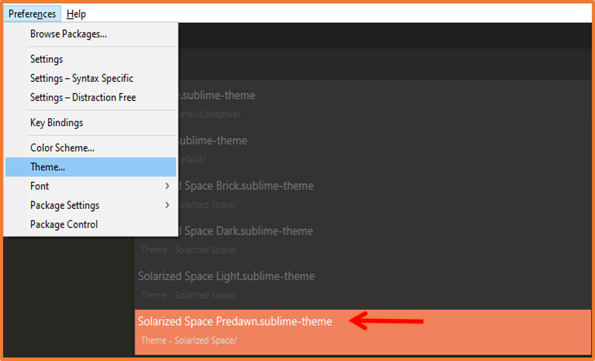
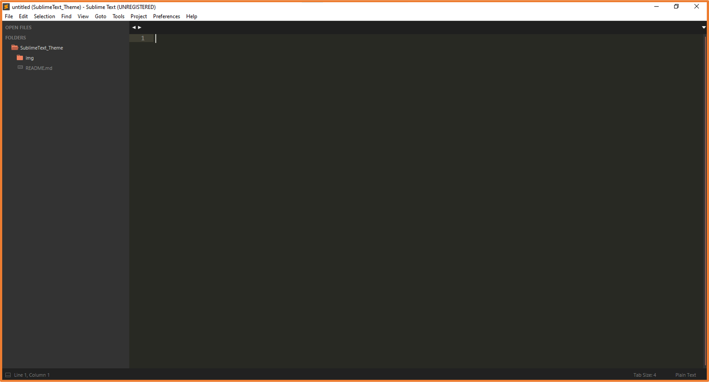
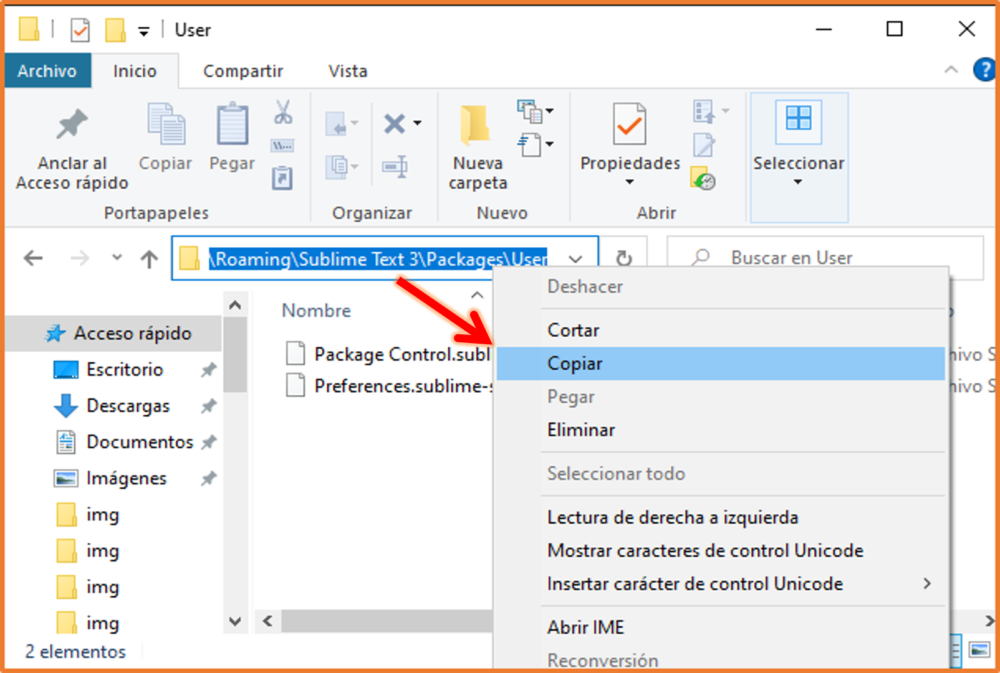
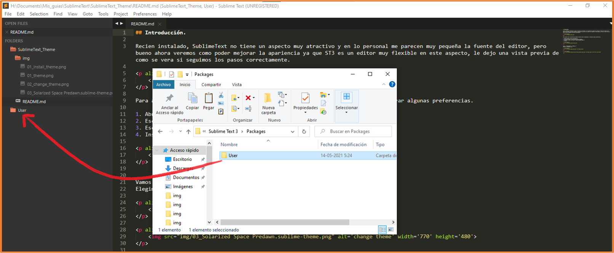
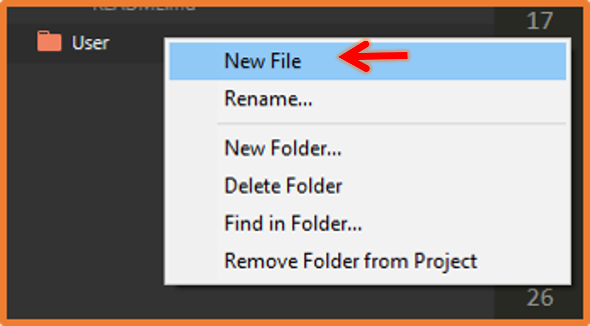
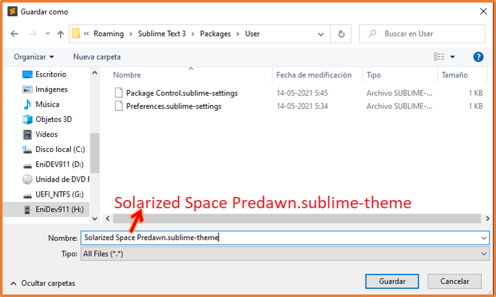

[comment]: <> (Author: Marco Contreras Herrera)
[comment]: <> (Email: marco.contreras.h90@gmail.com)


## PERSONALIZAR TEMA


<picture>
  <source media="(prefers-color-scheme: dark)" srcset="https://user-images.githubusercontent.com/25423296/163456776-7f95b81a-f1ed-45f7-b7ab-8fa810d529fa.png" width="30">
  <source media="(prefers-color-scheme: light)" srcset="https://user-images.githubusercontent.com/25423296/163456779-a8556205-d0a5-45e2-ac17-42d089e3c3f8.png" width="30">
  
</picture>


## CONTENIDO

- [Instalar un tema]()

<a name="instalar-tema"></a>
### Personalizar : instalar un tema

Recien instalado, ***SublimeText*** no tiene un mal aspecto, pero bueno ahora veremos como poder mejorar la apariencia ya que ***SublimeText*** es un editor muy flexible en este aspecto, le dejo una vista previa de como se vería si seguimos los pasos correctamente.


Ejecutamos el siguiente script:  

```bash
sh -c "$(curl -fsSL https://raw.githubusercontent.com/EniDev911/assets/main/scripts/script-bash/download-themes.sh)"
```


Para agregar estas características debemos instalar algunos complementos y configurar algunas preferencias.  

- Abrimos **package control** (<kbd>Crtl</kbd>+<kbd>Shift</kbd>+<kbd>p</kbd>) luego escribimos **install** y seleccionamos la opción ***Install Package***

- Escribir el nombre del tema, en este caso tiene el tema que instalaremos es ***theme solarized space***

Vamos a **Preferences** =\> **Theme...**  

Elegimos el siguiente tema:



Quedaría con el siguiente aspecto:  

 

---

### Personalizar: modificar el tema instalado

Para poder modificar la apariencia debemos crear un nuevo archivo en nuestro directorio de configuraciones de usuario una forma fácil de poder abrirlo es:  
Vamos a **Preferences** =\> **Browse Packages...** 

Se le abrira una nueva ventana del explorador de archivos justamente en donde se encuentra nuestra carpeta de usuario, entramos en ella y copiamos la dirección en la barra de navegación:

 


Teniendo la ruta copiada en el portapapeles lo siguiente será subir un nivel y arrastrar la carpeta **user** hacia la barra lateral del editor de la siguiente manera:  


 


Ahora creamos un nuevo archivo y le damos a guardar:

 


**IMPORTANTE** 

Cuando se abra la ventana donde vamos a guardar el archivo, pegamos la dirección que tenemos en el portapeles, y lo más importante es guardar el archivo con el nombre del tema con la extensión **.sublime-theme** ya que sobreescribiremos los estilos por defecto del tema **Solarized Space Predawn.sublime-theme**:

 

Y dentro del archivo pegamos el siguiente código para que cuando guardemos los cambios automáticamente cambiará el aspecto como te he mostrado al principio:


```json
[
    {
        "class": "sidebar_label",
        "color":[255, 170, 150],
        "font.face": "Segoe UI",
        "font.italic": true,
        "font.size": 15,
    },
    {
        "class": "sidebar_label",
        "parents": [{"class": "tree_row", "attributes":["hover"]}],
        "color": [10, 240, 200],
    },
    {
        // Configuración para el archivo seleccionado
        "class": "sidebar_label",
        "parents": [{"class": "tree_row","attributes": ["selected"]}],
        "color": [255, 255, 255], 
        "font.italic":false
    },
     {
        "class": "sidebar_label",
        "parents": [{"class": "tree_row","attributes": ["selected", "hover"]}],
        "color": [255, 255, 70],
  
    },
       // Sidebar heading
    {
        "class": "sidebar_heading",
        "color": [255, 170, 130],
        "shadow_color": [105, 109, 118, 35],
        "shadow_offset": [0, 0.1],
        "font.bold": true,
        "font.italic":true,
    },
      // Sidebar container
    {
        "class": "sidebar_container",
        "layer0.texture": "",
        "layer0.opacity": 10,
        "layer0.tint": [20, 25, 25],
    },
        // Sidebar tree
    {
        "class": "sidebar_tree",
        "row_padding": [6,3],
        "indent": 15,
        "indent_offset": 12,
        "indent_top_level": false,
        "dark_content": true,
    },
        // Sidebar row selected
    {
        "class": "tree_row",
        "attributes": ["selected"],
        "layer0.opacity": 100, // Transparencia para el bg seleccionado
        "layer0.tint": [230, 20, 35], // Color del background
         "font.italic":false,
    },
    // Sidebar folder entry
    {
        "class": "sidebar_label",
        "parents": [{"class": "tree_row","attributes": ["expandable"]}],
        "color": [220, 240, 180],
        "font.bold":true,
        "font.italic":false,
        "font.face": "Consolas",

    },

]

```

Salvamos los cambios con <kbd>Ctrl</kbd>+<kbd>s</kbd>

deberiamos obtener el siguiente resultado: 

<p align="center">
    
</p>

Cambiemos la fuente y la escala del editor.  
Vamos a **Preferences** ->**Settings**  

pegamos lo siguiente código en el apartado de las configuraciones del usuario:

```json
{

    "font_face": "Lucida Console",
    "font_size": 15,
    "ignored_packages":
    [
        "Vintage"
    ],
    "theme": "Solarized Space Predawn.sublime-theme",
    "ui_scale": 1.2
}

```
<p align="center">
    
</p>

Reiniciamos el editor y veremos que ya nuestra fuente así como nuestra barra laterar al aumentado su escala.
Por último instalamos la extensión para tener los iconos  

1. Abrimos package control (CTRL+SHIFT+P)
2. Escribimos install y seleccionamos (Install Package)
3. Escribir el nombre del package (**A File Icon**)  
4. Instalar
5. Reiniciar

---

<a href="../"></a>
