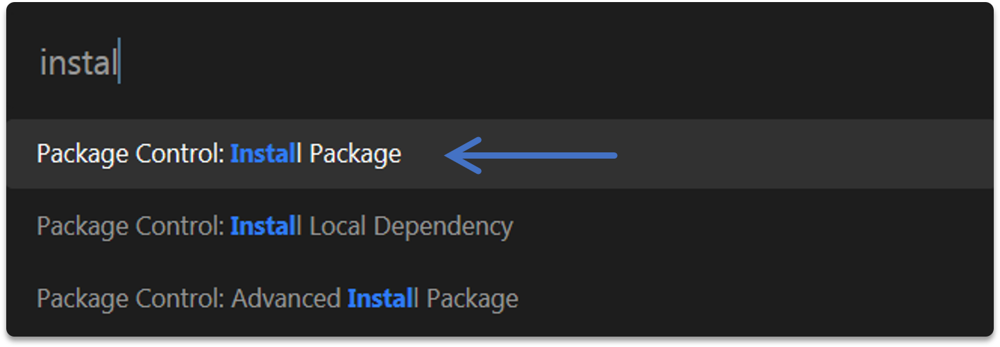

[comment]: <> (Author: Marco Contreras Herrera)
[comment]: <> (Email: marco.contreras.h90@gmail.com)


## EXTENSION TERMINUS


- [Configurar otras terminales](#configurar-otras-terminales)
- [Configurar atajos de teclado para terminus](#configurar-shorcuts-terminus)


**1)** Presionar <kbd>CTRL</kbd> + <kbd>SHIFT</kbd> + <kbd>P</kbd>  para instalar un nuevo paquete:  

<p align="center">
  
</p>


**2)** Buscar el paquete **Terminus** e instalarlo


<a href="configurar-terminales"></a>
## Configurar otras terminales


Configurar **Git-bash** para plataforma windows en Terminus:

```js
"shell_configs":
   [
      {
          "name": "Git Bash",
          "cmd": ["cmd.exe", "/k", "C:/Program Files (x86)/Git/bin/bash.exe"],
          "env": {},
          "enable": true,
          "default": false,
          "platforms": ["windows"]
      }
   ]
```


--- 

<a name="configurar-shorcuts-terminus"></a>
## Configurar atajos de teclado para Terminus


Alternar el panel de Terminus: 


```json
{ 
  "keys": ["alt+j"], 
  "command": "toggle_terminus_panel"
}
```


Configurar **Git-bash** para plataforma windows en Terminus:


```js
{
  //for git bash
  "keys": ["alt+j"],
  "command": "terminus_open",
  "args" : {
      "cmd": ["C:/Program Files/Git/bin/sh.exe"],
      "cwd": "${file_path:${folder}}",
      "panel_name": "Terminus"
    }
}
```

Configurar **CMD** para plataforma windows en Terminus:


```js
{
  //for CMD
  "keys": ["alt+c"],
  "command": "terminus_open",
  "args" : {
      "cmd": "cmd.exe",
      "cwd": "${file_path:${folder}}",
      "panel_name": "Terminus"
  }
}
```

