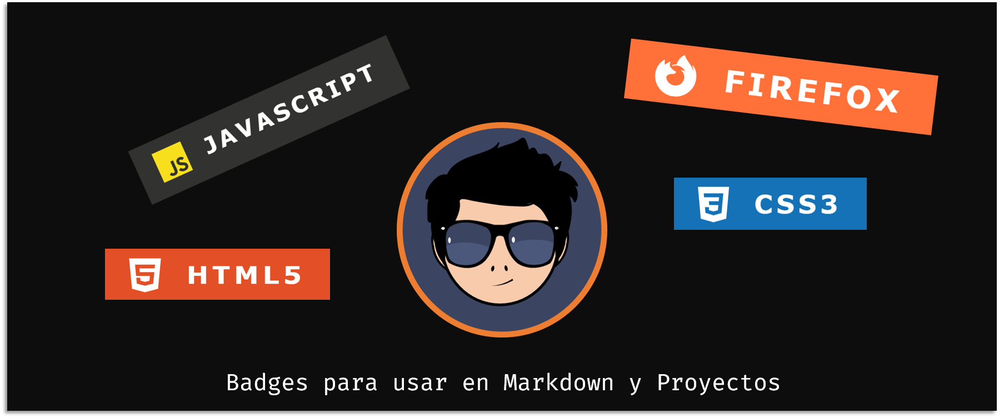

# Badges
Para agregar a profile y proyectos.

# Tabla de contenido
- [Uso](#uso)
- [Tips](#tips)
- [Badges](#badges)
  - 
 
Lista de badges

 
     - [Inteligencia Artificial y Bots](#artificial-intelligence-and-bots)
     - [Bases de datos](#databases)
     - [Navegadores](#browsers)
     - [Control de versiones](#control-version)
     - [Frameworks, Platformas y  Librerías](#frameworks-platforms-libraries)
     - [IDEs/Editors](#ide-editor)
     - [Lenguajes](#languages)
     - [Sistemas operativos](#operating-system)
     - [Social](#social)
     - [Otros](#others)
   

# Uso
Para usar un badge:

**Via Github**

1. Presionar la combinación <kbd>Ctrl</kbd> + <kbd>f</kbd> del teclado, para abrir la caja de búsqueda en una ventana modal.
1. Escribir el nombre del badge que necesitas.
1. Copiamos el elemento apropiado `` y pegamos en nuestro archivo de Markdown (**Ej: readme.md**) 
1. Para usarlo en un documento **HTML** copiamos el fragmento del link y pegamos dentro de una etiqueta **img** dentro del atributo **src** (**Ej:** ``) 

# Tips

 

👇 Como usar diferentes estilos de badge

<blockquote><strong>Nota:</strong> <code><strong>for-the-badge</strong></code> es el estilo que e usado por cosa de apariencia. Otros estilos están disponible en <a href="https://shields.io/#styles">shields.io</a>.</blockquote>

<table style="text-align: center;">
	<caption><strong>Shields.io</strong> ofrece 5 estilos:</caption>
	<colgroup>
		<col span="1">
		<col span="1">
		<col span="1">
	</colgroup>
	<thead>
		<tr>
			<th>S/N</th>
			<th>Tipos</th>
			<th>Estilos</th>
		</tr>
	</thead>
	<tbody>
		<!-- Plastic -->	
		<tr>
			<td>1</td>
			<td>Plastic</td>
			<td>
				
			</td>
		</tr>
		<!-- Flat Square -->
		<tr>
			<td>2</td>
			<td>Flat Square</td>
			<td>
				
			</td>
		</tr>
		<!-- Flat -->
		<tr>
			<td>3</td>
			<td>Flat</td>
			<td>
				
			</td>
		</tr>
		<!-- Social -->
		<tr>
			<td>4</td>
			<td>Social</td>
			<td>
				
			</td>
		</tr>
		<!-- For the badge -->
		<tr>
			<td>5</td>
			<td>For-the-badge</td>
			<td>
				
			</td>
		</tr>
	</tbody>
</table>
                                                                                                    |
💡 Para usar un estilo diferente: Remplaza <code>for-the-badge</code> en el link.  

<pre>
Ejemplo.

🧷  plastic
https://shields.io/badge/style-plastic-green?logo=appveyor&style=plastic
	
🧷  Flat
https://shields.io/badge/style-flat-green?logo=appveyor&style=flat
</pre>

# Badges

###  🤖 Inteligencia Artificial y Bots

<table style="text-align: center;">
	<caption><strong>Badges</strong> 🤖</caption>
	<colgroup>
		<col span="1">
		<col span="1">
		<col span="1">
	</colgroup>
	<thead>
		<tr>
			<th>NOMBRE</th>
			<th>BADGE</th>
			<th>MARKDOWN</th>
		</tr>
	</thead>
	<tbody>
		<!-- Amazon Alexa -->	
		<tr>
			<td align="center">Amazon Alexa</td>
			<td>
				
			</td>
			<td align="left">
				<code>	
				
				</code>
			</td>
		</tr>
		<!-- Dependabot -->
		<tr>
			<td align="center">Dependabot</td>
			<td align="center">
				
			</td>
			<td align="left">
				<code>
					
				</code>
			</td>
		</tr>
		<!-- Google Assistant -->
		<tr>
			<td align="center">Google Assistant</td>
			<td align="center">
				
			</td>
			<td align="left">
				<code>
				
				</code>
			</td>
		</tr>
	</tbody>
</table>

---

###  🌐 Navegadores

<table style="text-align: center;">
	<caption><strong>Badges</strong> 🌐</caption>
	<colgroup>
		<col span="1">
		<col span="1">
		<col span="1">
	</colgroup>
	<thead>
		<tr>
			<th>NOMBRE</th>
			<th>BADGE</th>
			<th>MARKDOWN</th>
		</tr>
	</thead>
	<tbody>
		<!-- Brave -->	
		<tr>
			<td align="center">Brave</td>
			<td align="center">
				
			</td>
			<td align="left">
				<code>
					 
				</code>
			</td>
		</tr>
		<!-- Edge -->
		<tr>
			<td align="center">Edge</td>
			<td align="center">
				
			</td>
			<td align="left">
				<code>
					    
				</code>
			</td>
		</tr>
		<!-- Firefox -->
		<tr>
			<td align="center">Firefox</td>
			<td align="center">
				
			</td>
			<td align="left">
				<code>
					
				</code>
			</td>
		</tr>
		<!-- Google Chrome -->
		<tr align="center">
			<td align="center">Google Chrome</td>
			<td align="center">
				
			</td>
			<td align="left">
				<code>
					
				</code>
			</td>
		</tr>
		<!-- Opera -->
		<tr>
			<td align="center">Opera</td>
			<td align="center">
				
			</td>
			<td align="left">
				<code>
					 
				</code>
			</td>
		</tr>
		<!-- Safari -->
		<tr>
			<td align="center">Safari</td>
			<td align="center">
				
			</td>
			<td align="left">
				<code>
					
				</code>
			</td>
		</tr>
		<!-- Tor -->
		<tr>
			<td align="center">Tor</td>
			<td align="center">
				
			</td>
			<td align="left">
				<code>
					
				</code>
			</td>
		</tr>
		<!-- Vivaldi -->
		<tr>
			<td align="center">Vivaldi</td>
			<td align="center">
				
			</td>
			<td align="left">
				<code>
					
				</code>
			</td>
		</tr>
	</tbody>
</table>

---

###  💾 Bases de datos

<table style="text-align: center;">
	<caption><strong>Badges</strong> 💾</caption>
	<colgroup>
		<col span="1">
		<col span="1">
		<col span="1">
	</colgroup>
	<thead>
		<tr>
			<th>NOMBRE</th>
			<th>BADGE</th>
			<th>MARKDOWN</th>
		</tr>
	</thead>
	<tbody>
		<!-- Amazon DynamoDB  -->	
		<tr>
			<td align="center">Amazon DynamoDB</td>
			<td align="center">
				
			</td>
			<td align="left">
				<code>
					 
				</code>
			</td>
		</tr>
		<!-- Cassandra -->
		<tr>
			<td align="center">Cassandra</td>
			<td align="center">
				
			</td>
			<td align="left">
				<code>
					    
				</code>
			</td>
		</tr>
		<!-- Cockroach Labs -->
		<tr>
			<td align="center">Cockroach Labs</td>
			<td align="center">
				
			</td>
			<td align="left">
				<code>
					
				</code>
			</td>
		</tr>
		<!-- Couchbase -->
		<tr>
			<td align="center">Couchbase</td>
			<td align="center">
				
			</td>
			<td align="left">
				<code>
					
				</code>
			</td>
		</tr>
		<!-- Firebase -->
		<tr>
			<td align="center">Firebase</td>
			<td align="center">
				
			</td>
			<td align="left">
				<code>
					
				</code>
			</td>
		</tr>
		<!-- InfluxDB -->
		<tr>
			<td align="center">InfluxDB</td>
			<td align="center">
				
			</td>
			<td align="left">
				<code>
					
				</code>
			</td>
		</tr>
		<!-- MariaDB -->
		<tr>
			<td align="center">MariaDB</td>
			<td align="center">
				
			</td>
			<td align="left">
				<code>
					
				</code>
			</td>
		</tr>
		<!-- Microsoft SQL Server -->
		<tr>
			<td align="center">Microsoft SQL Server</td>
			<td align="center">
				
			</td>
			<td align="left">
				<code>
					
				</code>
			</td>
		</tr>
		<!-- MongoDB -->
		<tr>
			<td align="center">MongoDB</td>
			<td align="center">
				
			</td>
			<td align="left">
				<code>
					
				</code>
			</td>
		</tr>
		<!-- MySQL -->
		<tr>
			<td align="center">MySQL</td>
			<td align="center">
				
			</td>
			<td align="left">
				<code>
					
				</code>
			</td>
		</tr>
		<!-- Neo4J -->
		<tr>
			<td align="center">Neo4J</td>
			<td align="center">
				
			</td>
			<td align="left">
				<code>
					
				</code>
			</td>
		</tr>
		<!-- Postgres -->
		<tr>
			<td align="center">Postgres</td>
			<td align="center">
				
			</td>
			<td align="left">
				<code>
					
				</code>
			</td>
		</tr>
		<!-- Redis -->
		<tr>
			<td align="center">Redis</td>
			<td align="center">
				
			</td>
			<td align="left">
				<code>
					
				</code>
			</td>
		</tr>
		<!-- SQLite -->
		<tr>
			<td align="center">SQLite</td>
			<td align="center">
				
			</td>
			<td align="left">
				<code>
					
				</code>
			</td>
		</tr>
	</tbody>
</table>

---

###  💬 Social

<table style="text-align: center;">
	<caption><strong>Badges</strong> 💬</caption>
	<colgroup>
		<col span="1">
		<col span="1">
		<col span="1">
	</colgroup>
	<thead>
		<tr>
			<th>NOMBRE</th>
			<th>BADGE</th>
			<th>MARKDOWN</th>
		</tr>
	</thead>
	<tbody>
		<!-- Discord  -->	
		<tr>
			<td align="center">Discord</td>
			<td align="center">
				
			</td>
			<td align="left">
				<code>
					 
				</code>
			</td>
		</tr>
		<!-- Facebook -->
		<tr>
			<td align="center">Facebook</td>
			<td align="center">
				
			</td>
			<td align="left">
				<code>
					    
				</code>
			</td>
		</tr>
		<!-- Gmail -->
		<tr>
			<td align="center">Gmail</td>
			<td align="center">
				
			</td>
			<td align="left">
				<code>
					
				</code>
			</td>
		</tr>
		<!-- Google Meet -->
		<tr>
			<td align="center">Google Meet</td>
			<td align="center">
				
			</td>
			<td align="left">
				<code>
					
				</code>
			</td>
		</tr>
		<!-- Instagram -->
		<tr>
			<td align="center">Instagram</td>
			<td align="center">
				
			</td>
			<td align="left">
				<code>
				</code>
			</td>
		</tr>
		<!-- Instagram-2 -->
		<tr>
			<td align="center">Instagram</td>
			<td align="center">
				
			</td>
			<td align="left">
				<code>
				</code>
			</td>
		</tr>
		<!-- LinkedIn -->
		<tr>
			<td align="center">LinkedIn</td>
			<td align="center">
				
			</td>
			<td align="left">
				<code>
					
				</code>
			</td>
		</tr>
		<!-- Messenger -->
		<tr>
			<td align="center">Messenger</td>
			<td align="center">
				
			</td>
			<td align="left">
				<code>
					
				</code>
			</td>
		</tr>
		<!-- Skype -->
		<tr>
			<td align="center">Skype</td>
			<td align="center">
				
			</td>
			<td align="left">
				<code>
					
				</code>
			</td>
		</tr>
		<!-- Slack -->
		<tr>
			<td align="center">Slack</td>
			<td align="center">
				
			</td>
			<td align="left">
				<code>
					
				</code>
			</td>
		</tr>
		<!-- Telegram -->
		<tr>
			<td align="center">Telegram</td>
			<td align="center">
				
			</td>
			<td align="left">
				<code>
					
				</code>
			</td>
		</tr>
		<!-- TikTok -->
		<tr>
			<td align="center">TikTok</td>
			<td align="center">
				
			</td>
			<td align="left">
				<code>
					
				</code>
			</td>
		</tr>
		<!-- Twitch -->
		<tr>
			<td align="center">Twitch</td>
			<td align="center">
				
			</td>
			<td align="left">
				<code>
					
				</code>
			</td>
		</tr>
		<!-- Twitter -->
		<tr>
			<td align="center">Twitter</td>
			<td align="center">
				
			</td>
			<td align="left">
				<code>
					
				</code>
			</td>
		</tr>
		<!-- WhatsApp -->
		<tr>
			<td align="center">WhatsApp</td>
			<td align="center">
				
			</td>
			<td align="left">
				<code>
					
				</code>
			</td>
		</tr>
		<!-- YouTube -->
		<tr>
			<td align="center">YouTube</td>
			<td align="center">
				
			</td>
			<td align="left">
				<code>
					
				</code>
			</td>
		</tr>
		<!-- Zoom -->
		<tr>
			<td align="center">Zoom</td>
			<td align="center">
				
			</td>
			<td align="left">
				<code>
					
				</code>
			</td>
		</tr>
	</tbody>
</table>

---

###  🕓 Control de versiones

<table style="text-align: center;">
	<caption><strong>Badges</strong>&nbsp;&nbsp;</caption>
	<colgroup>
		<col span="1">
		<col span="1">
		<col span="1">
	</colgroup>
	<thead>
		<tr>
			<th>NOMBRE</th>
			<th>BADGE</th>
			<th>MARKDOWN</th>
		</tr>
	</thead>
	<tbody>
		<!-- Bitbucket  -->	
		<tr>
			<td align="center">Bitbucket</td>
			<td align="center">
				
			</td>
			<td align="left">
				<code>
					 
				</code>
			</td>
		</tr>
		<!-- Git -->
		<tr>
			<td align="center">Git</td>
			<td align="center">
				
			</td>
			<td align="left">
				<code>
				</code>
			</td>
		</tr>
		<!-- Gitea -->
		<tr>
			<td align="center">Gitea</td>
			<td align="center">
				
			</td>
			<td align="left">
				<code>
					
				</code>
			</td>
		</tr>
		<!-- Gitee -->
		<tr>
			<td align="center">Gitee</td>
			<td align="center">
				
			</td>
			<td align="left">
				<code>
					
				</code>
			</td>
		</tr>
		<!-- GitHub -->
		<tr>
			<td align="center">GitHub</td>
			<td align="center">
				
			</td>
			<td align="left">
				<code>
					
				</code>
			</td>
		</tr>
		<!-- GitLab -->
		<tr>
			<td align="center">GitLab</td>
			<td align="center">
				
			</td>
			<td align="left">
				<code>
					
				</code>
			</td>
		</tr>
		<!-- Gitpod -->
		<tr>
			<td align="center">Gitpod</td>
			<td align="center">
				
			</td>
			<td align="left">
				<code>
					
				</code>
			</td>
		</tr>
	</tbody>
</table>

---

### 💻 IDEs/Editores

<table style="text-align: center;">
	<caption><strong>Badges</strong> 💻</caption>
	<colgroup>
		<col span="1">
		<col span="1">
		<col span="1">
	</colgroup>
	<thead>
		<tr>
			<th>NOMBRE</th>
			<th>BADGE</th>
			<th>MARKDOWN</th>
		</tr>
	</thead>
	<tbody>
		<!-- Android Studio  -->	
		<tr>
			<td align="center">Android Studio</td>
			<td align="center">
				
			</td>
			<td align="left">
				<code>
					 
				</code>
			</td>
		</tr>
		<!-- Atom -->
		<tr>
			<td align="center">Atom</td>
			<td align="center">
				
			</td>
			<td align="left">
				<code>
				</code>
			</td>
		</tr>
		<!-- CLion -->
		<tr>
			<td align="center">CLion</td>
			<td align="center">
				
			</td>
			<td align="left">
				<code>
					
				</code>
			</td>
		</tr>
		<!-- CodePen -->
		<tr>
			<td align="center">CodePen</td>
			<td align="center">
				
			</td>
			<td align="left">
				<code>
					
				</code>
			</td>
		</tr>
		<!-- CodePen-2 -->
		<tr>
			<td align="center">CodePen</td>
			<td align="center">
				
			</td>
			<td align="left">
				<code>
					
				</code>
			</td>
		</tr>
		<!-- CodeSandbox -->
		<tr>
			<td align="center">CodeSandbox</td>
			<td align="center">
				
			</td>
			<td align="left">
				<code>
					
				</code>
			</td>
		</tr>
		<!-- Eclipse -->
		<tr>
			<td align="center">Eclipse</td>
			<td align="center">
				
			</td>
			<td align="left">
				<code>
					
				</code>
			</td>
		</tr>
		<!-- Emacs -->
		<tr>
			<td align="center">Emacs</td>
			<td align="center">
				
			</td>
			<td align="left">
				<code>
					
				</code>
			</td>
		</tr>
		<!-- Sublime Text -->
		<tr>
			<td align="center">Sublime Text</td>
			<td align="center">
				
			</td>
			<td align="left">
				<code>
					
				</code>
			</td>
		</tr>
		<!-- Sublime Text-2 -->
		<tr>
			<td align="center">Sublime Text</td>
			<td align="center">
				
			</td>
			<td align="left">
				<code>
					
				</code>
			</td>
		</tr>
		<!-- Vim -->
		<tr>
			<td align="center">Vim</td>
			<td align="center">
				
			</td>
			<td align="left">
				<code>
					
				</code>
			</td>
		</tr>
		<!-- Visual Studio Code -->
		<tr>
			<td align="center">Visual Studio Code</td>
			<td align="center">
				
			</td>
			<td align="left">
				<code>
					
				</code>
			</td>
		</tr>
		<!-- Visual Studio -->
		<tr>
			<td align="center">Visual Studio</td>
			<td align="center">
				
			</td>
			<td align="left">
				<code>
					
				</code>
			</td>
		</tr>
		<!-- Xcode -->
		<tr>
			<td align="center">Xcode</td>
			<td align="center">
				
			</td>
			<td align="left">
				<code>
					
				</code>
			</td>
		</tr>
	</tbody>
</table>

---

###  Lenguajes

<table style="text-align: center;">
	<colgroup>
		<col span="1">
		<col span="1">
		<col span="1">
	</colgroup>
	<thead>
		<tr>
			<th>NOMBRE</th>
			<th>BADGE</th>
			<th>MARKDOWN</th>
		</tr>
	</thead>
	<tbody>
		<!-- Apache Groovy  -->	
		<tr>
			<td align="center">Apache Groovy</td>
			<td align="center">
				
			</td>
			<td align="left">
				<code>
					 
				</code>
			</td>
		</tr>
		<!-- C -->
		<tr>
			<td align="center">C</td>
			<td align="center">
				
			</td>
			<td align="left">
				<code>
				</code>
			</td>
		</tr>
		<!-- C# -->
		<tr>
			<td align="center">C#</td>
			<td align="center">
				
			</td>
			<td align="left">
				<code>
					
				</code>
			</td>
		</tr>
		<!-- C++ -->
		<tr>
			<td align="center">C++</td>
			<td align="center">
				
			</td>
			<td align="left">
				<code>
					
				</code>
			</td>
		</tr>
		<!-- Crystal -->
		<tr>
			<td align="center">Crystal</td>
			<td align="center">
				
			</td>
			<td align="left">
				<code>
					
				</code>
			</td>
		</tr>
		<!-- CSS3 -->
		<tr>
			<td align="center">CSS3</td>
			<td align="center">
				
			</td>
			<td align="left">
				<code>
					
				</code>
			</td>
		</tr>
		<!-- Clojure -->
		<tr>
			<td align="center">Clojure</td>
			<td align="center">
				
			</td>
			<td align="left">
				<code>
					
				</code>
			</td>
		</tr>
		<!-- Dart -->
		<tr>
			<td align="center">Dart</td>
			<td align="center">
				
			</td>
			<td align="left">
				<code>
					
				</code>
			</td>
		</tr>
		<!-- Elixir -->
		<tr>
			<td align="center">Elixir</td>
			<td align="center">
				
			</td>
			<td align="left">
				<code>
					
				</code>
			</td>
		</tr>
		<!-- Elm -->
		<tr>
			<td align="center">Elm</td>
			<td align="center">
				
			</td>
			<td align="left">
				<code>
					
				</code>
			</td>
		</tr>
		<!-- Erlang -->
		<tr>
			<td align="center">Erlang</td>
			<td align="center">
				
			</td>
			<td align="left">
				<code>
					
				</code>
			</td>
		</tr>
		<!-- Fortran -->
		<tr>
			<td align="center">Fortran</td>
			<td align="center">
				
			</td>
			<td align="left">
				<code>
					
				</code>
			</td>
		</tr>
		<!-- Go/Golang -->
		<tr>
			<td align="center">Go/Golang</td>
			<td align="center">
				
			</td>
			<td align="left">
				<code>
					
				</code>
			</td>
		</tr>
		<!-- GraphQL -->
		<tr>
			<td align="center">GraphQL</td>
			<td align="center">
				
			</td>
			<td align="left">
				<code>
					
				</code>
			</td>
		</tr>
		<!-- Haskell -->
		<tr>
			<td align="center">Haskell</td>
			<td align="center">
				
			</td>
			<td align="left">
				<code>
					
				</code>
			</td>
		</tr>
		<!-- HTML5 -->
		<tr>
			<td align="center">HTML5</td>
			<td align="center">
				
			</td>
			<td align="left">
				<code>
					
				</code>
			</td>
		</tr>
		<!-- Java -->
		<tr>
			<td align="center">Java</td>
			<td align="center">
				
			</td>
			<td align="left">
				<code>
					
				</code>
			</td>
		</tr>
		<!-- JavaScript -->
		<tr>
			<td align="center">JavaScript</td>
			<td align="center">
				
			</td>
			<td align="left">
				<code>
					
				</code>
			</td>
		</tr>
		<!-- Julia -->
		<tr>
			<td align="center">Julia</td>
			<td align="center">
				
			</td>
			<td align="left">
				<code>
					
				</code>
			</td>
		</tr>
		<!-- Kotlin -->
		<tr>
			<td align="center">Kotlin</td>
			<td align="center">
				
			</td>
			<td align="left">
				<code>
					
				</code>
			</td>
		</tr>
		<!-- LaTeX -->
		<tr>
			<td align="center">LaTeX</td>
			<td align="center">
				
			</td>
			<td align="left">
				<code>
					
				</code>
			</td>
		</tr>
		<!-- Lua -->
		<tr>
			<td align="center">Lua</td>
			<td align="center">
				
			</td>
			<td align="left">
				<code>
					
				</code>
			</td>
		</tr>
		<!-- Markdown -->
		<tr>
			<td align="center">Markdown</td>
			<td align="center">
				
			</td>
			<td align="left">
				<code>
					
				</code>
			</td>
		</tr>
		<!-- PHP -->
		<tr>
			<td align="center">PHP</td>
			<td align="center">
				
			</td>
			<td align="left">
				<code>
					
				</code>
			</td>
		</tr>
		<!-- Python -->
		<tr>
			<td align="center">Python</td>
			<td align="center">
				
			</td>
			<td align="left">
				<code>
					
				</code>
			</td>
		</tr>
		<!-- Python-2 -->
		<tr>
			<td align="center">Python</td>
			<td align="center">
				
			</td>
			<td align="left">
				<code>
					
				</code>
			</td>
		</tr>		
		<!-- R -->
		<tr>
			<td align="center">R</td>
			<td align="center">
				
			</td>
			<td align="left">
				<code>
					
				</code>
			</td>
		</tr>
		<!-- Ruby -->
		<tr>
			<td align="center">Ruby</td>
			<td align="center">
				
			</td>
			<td align="left">
				<code>
					
				</code>
			</td>
		</tr>
		<!-- Rust -->
		<tr>
			<td align="center">Rust</td>
			<td align="center">
				
			</td>
			<td align="left">
				<code>
					
				</code>
			</td>
		</tr>
		<!-- Scala -->
		<tr>
			<td align="center">Scala</td>
			<td align="center">
				
			</td>
			<td align="left">
				<code>
					
				</code>
			</td>
		</tr>
		<!-- Shell Script -->
		<tr>
			<td align="center">Shell Script</td>
			<td align="center">
				
			</td>
			<td align="left">
				<code>
					
				</code>
			</td>
		</tr>
		<!-- Solidity -->
		<tr>
			<td align="center">Solidity</td>
			<td align="center">
				
			</td>
			<td align="left">
				<code>
					
				</code>
			</td>
		</tr>
		<!-- Swift -->
		<tr>
			<td align="center">Swift</td>
			<td align="center">
				
			</td>
			<td align="left">
				<code>
					
				</code>
			</td>
		</tr>
		<!-- TypeScript -->
		<tr>
			<td align="center">TypeScript</td>
			<td align="center">
				
			</td>
			<td align="left">
				<code>
					
				</code>
			</td>
		</tr>
	</tbody>
</table>

---

###  📚 Frameworks, Platforomas y Librerias

<table style="text-align: center;">
	<caption><strong>Badges</strong> 📚</caption>
	<colgroup>
		<col span="1">
		<col span="1">
		<col span="1">
	</colgroup>
	<thead>
		<tr>
			<th>NOMBRE</th>
			<th>BADGE</th>
			<th>MARKDOWN</th>
		</tr>
	</thead>
	<tbody>
		<!-- .NET  -->	
		<tr>
			<td align="center">.NET</td>
			<td align="center">
				
			</td>
			<td align="left">
				<code>
					 
				</code>
			</td>
		</tr>
		<!-- AdonisJS -->
		<tr>
			<td align="center">AdonisJS</td>
			<td align="center">
				
			</td>
			<td align="left">
				<code>
				</code>
			</td>
		</tr>
		<!-- Anaconda -->
		<tr>
			<td align="center">Anaconda</td>
			<td align="center">
				
			</td>
			<td align="left">
				<code>
					
				</code>
			</td>
		</tr>
		<!-- Angular -->
		<tr>
			<td align="center">Angular</td>
			<td align="center">
				
			</td>
			<td align="left">
				<code>
					
				</code>
			</td>
		</tr>
			<!-- Babel -->
		<tr>
			<td align="center">Babel</td>
			<td align="center">
				
			</td>
			<td align="left">
				<code>
					
				</code>
			</td>
		</tr>
		<!-- Blazor -->
		<tr>
			<td align="center">Blazor</td>
			<td align="center">
				
			</td>
			<td align="left">
				<code>
					
				</code>
			</td>
		</tr>
		<!-- Bootstrap -->
		<tr>
			<td align="center">Bootstrap</td>
			<td align="center">
				
			</td>
			<td align="left">
				<code>
					
				</code>
			</td>
		</tr>
		<!-- Code Igniter -->
		<tr>
			<td align="center">Code Igniter</td>
			<td align="center">
				
			</td>
			<td align="left">
				<code>
					
				</code>
			</td>
		</tr>
		<!-- Deno JS -->
		<tr>
			<td align="center">Deno JS</td>
			<td align="center">
				
			</td>
			<td align="left">
				<code>
					
				</code>
			</td>
		</tr>
		<!-- Django -->
		<tr>
			<td align="center">Django</td>
			<td align="center">
				
			</td>
			<td align="left">
				<code>
					
				</code>
			</td>
		</tr>
		<!-- Docker -->
		<tr>
			<td align="center">Docker</td>
			<td align="center">
				
			</td>
			<td align="left">
				<code>
					
				</code>
			</td>
		</tr>
		<!-- Express.js -->
		<tr>
			<td align="center">Express.js</td>
			<td align="center">
				
			</td>
			<td align="left">
				<code>
					
				</code>
			</td>
		</tr>
		<!-- Flask -->
		<tr>
			<td align="center">Flask</td>
			<td align="center">
				
			</td>
			<td align="left">
				<code>
					
				</code>
			</td>
		</tr>
		<!-- Flutter -->
		<tr>
			<td align="center">Flutter</td>
			<td align="center">
				
			</td>
			<td align="left">
				<code>
					
				</code>
			</td>
		</tr>
		<!-- jQuery -->
		<tr>
			<td align="center">jQuery</td>
			<td align="center">
				
			</td>
			<td align="left">
				<code>
					
				</code>
			</td>
		</tr>
		<!-- Less -->
		<tr>
			<td align="center">Less</td>
			<td align="center">
				
			</td>
			<td align="left">
				<code>
					
				</code>
			</td>
		</tr>
		<!-- Netlify -->
		<tr>
			<td align="center">Netlify</td>
			<td align="center">
				
			</td>
			<td align="left">
				<code></code>
			</td>
		</tr>
		<!-- NPM -->
		<tr>
			<td align="center">NPM</td>
			<td align="center">
				
			</td>
			<td align="left">
				<code>
					
				</code>
			</td>
		</tr>
		<!-- Node.js -->
		<tr>
			<td align="center">Node.js</td>
			<td align="center">
				
			</td>
			<td align="left">
				<code>
					
				</code>
			</td>
		</tr>
		<!-- React -->
		<tr>
			<td align="center">React</td>
			<td align="center">
				
			</td>
			<td align="left">
				<code>
					
				</code>
			</td>
		</tr>
		<!-- Spring -->
		<tr>
			<td align="center">Spring</td>
			<td align="center">
				
			</td>
			<td align="left">
				<code>
					
				</code>
			</td>
		</tr>
		<!-- Thymeleaf -->
		<tr>
			<td align="center">Thymeleaf</td>
			<td align="center">
				
			</td>
			<td align="left">
				<code>
					
				</code>
			</td>
		</tr>
		<!-- Vite.js -->
		<tr>
			<td align="center">Vite.js</td>
			<td align="center">
				
			</td>
			<td align="left">
				<code>
					
				</code>
			</td>
		</tr>
		<!-- Vue.js -->
		<tr>
			<td align="center">Vue.js</td>
			<td align="center">
				
			</td>
			<td align="left">
				<code>
					
				</code>
			</td>
		</tr>
		<!-- Webpack -->
		<tr>
			<td align="center">Webpack</td>
			<td align="center">
				
			</td>
			<td align="left">
				<code>
					
				</code>
			</td>
		</tr>
		<!-- Yarn -->
		<tr>
			<td align="center">Yarn</td>
			<td align="center">
				
			</td>
			<td align="left">
				<code>
					
				</code>
			</td>
		</tr>
	</tbody>
</table>

---

### <a name="servers"><a> 🗄️ Servers

<table style="text-align: center;">
	<caption><strong>Badges</strong> 🗄️</caption>
	<colgroup>
		<col span="1">
		<col span="1">
		<col span="1">
	</colgroup>
	<thead>
		<tr>
			<th>NOMBRE</th>
			<th>BADGE</th>
			<th>MARKDOWN</th>
		</tr>
	</thead>
	<tbody>
		<!-- Apache  -->	
		<tr>
			<td align="center">Apache</td>
			<td align="center">
				
			</td>
			<td align="left">
				<code>
					 
				</code>
			</td>
		</tr>
		<!-- Apache Airflow -->
		<tr>
			<td align="center">Apache Airflow</td>
			<td align="center">
				
			</td>
			<td align="left">
				<code>
				</code>
			</td>
		</tr>
		<!-- Apache Ant -->
		<tr>
			<td align="center">Apache Ant</td>
			<td align="center">
				
			</td>
			<td align="left">
				<code>
					
				</code>
			</td>
		</tr>
		<!-- Apache Flink -->
		<tr>
			<td align="center">Apache Flink</td>
			<td align="center">
				
			</td>
			<td align="left">
				<code>
					
				</code>
			</td>
		</tr>
		<!-- Apache Maven -->
		<tr>
			<td align="center">Apache Maven</td>
			<td align="center">
				
			</td>
			<td align="left">
				<code>
					
				</code>
			</td>
		</tr>
		<!-- Apache Tomcat -->
		<tr>
			<td align="center">Apache Tomcat</td>
			<td align="center">
				
			</td>
			<td align="left">
				<code>
					
				</code>
			</td>
		</tr>
		<!-- Gunicorn -->
		<tr>
			<td align="center">Gunicorn</td>
			<td align="center">
				
			</td>
			<td align="left">
				<code>
					
				</code>
			</td>
		</tr>
	</tbody>
</table>

---

### <a name="operating-system">🎛️ Sistema Operativos

<table style="text-align: center;">
	<caption><strong>Badges</strong> 🎛️</caption>
	<colgroup>
		<col span="1">
		<col span="1">
		<col span="1">
	</colgroup>
	<thead>
		<tr>
			<th>NOMBRE</th>
			<th>BADGE</th>
			<th>MARKDOWN</th>
		</tr>
	</thead>
	<tbody>
		<!-- Alpine Linux  -->	
		<tr>
			<td align="center">Alpine Linux</td>
			<td align="center">
				
			</td>
			<td align="left">
				<code>
					 
				</code>
			</td>
		</tr>
		<!-- Android -->
		<tr>
			<td align="center">Android</td>
			<td align="center">
				
			</td>
			<td align="left">
				<code>
				</code>
			</td>
		</tr>
		<!-- Arch -->
		<tr>
			<td align="center">Arch</td>
			<td align="center">
				
			</td>
			<td align="left">
				<code>
					
				</code>
			</td>
		</tr>
		<!-- Cent OS -->
		<tr>
			<td align="center">Cent OS</td>
			<td align="center">
				
			</td>
			<td align="left">
				<code>
					
				</code>
			</td>
		</tr>
		<!-- Chrome OS -->
		<tr>
			<td align="center">Chrome OS</td>
			<td align="center">
				
			</td>
			<td align="left">
				<code>
					
				</code>
			</td>
		</tr>
		<!-- Debian -->
		<tr>
			<td align="center">Debian</td>
			<td align="center">
				
			</td>
			<td align="left">
				<code>
					
				</code>
			</td>
		</tr>
		<!-- Deepin -->
		<tr>
			<td align="center">Deepin</td>
			<td align="center">
				
			</td>
			<td align="left">
				<code>
					
				</code>
			</td>
		</tr>
		<!-- Elementary OS -->
		<tr>
			<td align="center">Elementary OS</td>
			<td align="center">
				
			</td>
			<td align="left">
				<code>
					
				</code>
			</td>
		</tr>
		<!-- Fedora -->
		<tr>
			<td align="center">Fedora</td>
			<td align="center">
				
			</td>
			<td align="left">
				<code>
					
				</code>
			</td>
		</tr>
		<!-- FreeBSD -->
		<tr>
			<td align="center">FreeBSD</td>
			<td align="center">
				
			</td>
			<td align="left">
				<code>
					
				</code>
			</td>
		</tr>
		<!-- IOS -->
		<tr>
			<td align="center">IOS</td>
			<td align="center">
				
			</td>
			<td align="left">
				<code>
					
				</code>
			</td>
		</tr>
		<!-- Kali -->
		<tr>
			<td align="center">Kali</td>
			<td align="center">
				
			</td>
			<td align="left">
				<code>
					
				</code>
			</td>
		</tr>
		<!-- Kubuntu -->
		<tr>
			<td align="center">Kubuntu</td>
			<td align="center">
				
			</td>
			<td align="left">
				<code>
					
				</code>
			</td>
		</tr>
		<!-- Linux -->
		<tr>
			<td align="center">Linux</td>
			<td align="center">
				
			</td>
			<td align="left">
				<code>
					
				</code>
			</td>
		</tr>
		<!-- Linux Mint -->
		<tr>
			<td align="center">Linux Mint</td>
			<td align="center">
				
			</td>
			<td align="left">
				<code>
					
				</code>
			</td>
		</tr>
		<!-- Lubuntu -->
		<tr>
			<td align="center">Lubuntu</td>
			<td align="center">
				
			</td>
			<td align="left">
				<code>
					
				</code>
			</td>
		</tr>
		<!-- Lineageos -->
		<tr>
			<td align="center">Lineageos</td>
			<td align="center">
				
			</td>
			<td align="left">
				<code>
					
				</code>
			</td>
		</tr>
		<!-- Manjaro -->
		<tr>
			<td align="center">Manjaro</td>
			<td align="center">
				
			</td>
			<td align="left">
				<code>
					
				</code>
			</td>
		</tr>
		<!-- MX Linux -->
		<tr>
			<td align="center">MX Linux</td>
			<td align="center">
				
			</td>
			<td align="left">
				<code>
					
				</code>
			</td>
		</tr>
		<!-- Mac Os -->
		<tr>
			<td align="center">Mac Os</td>
			<td align="center">
				
			</td>
			<td align="left">
				<code>
					
				</code>
			</td>
		</tr>
		<!-- Openwrt -->
		<tr>
			<td align="center">Openwrt</td>
			<td align="center">
				
			</td>
			<td align="left">
				<code>
					
				</code>
			</td>
		</tr>
		<!-- OpenBSD -->
		<tr>
			<td align="center">OpenBSD</td>
			<td align="center">
				
			</td>
			<td align="left">
				<code>
					
				</code>
			</td>
		</tr>
		<!-- openSUSE -->
		<tr>
			<td align="center">openSUSE</td>
			<td align="center">
				
			</td>
			<td align="left">
				<code>
					
				</code>
			</td>
		</tr>
		<!-- Pop! OS -->
		<tr>
			<td align="center">Pop! OS</td>
			<td align="center">
				
			</td>
			<td align="left">
				<code>
					
				</code>
			</td>
		</tr>
		<!-- Red Hat -->
		<tr>
			<td align="center">Red Hat</td>
			<td align="center">
				
			</td>
			<td align="left">
				<code>
					
				</code>
			</td>
		</tr>
		<!-- Rocky Linux -->
		<tr>
			<td align="center">Rocky Linux</td>
			<td align="center">
				
			</td>
			<td align="left">
				<code>
				</code>
			</td>
		</tr>
		<!-- Suse -->
		<tr>
			<td align="center">Suse</td>
			<td align="center">
				
			</td>
			<td align="left">
				<code>
				</code>
			</td>
		</tr>
		<!-- Slackware -->
		<tr>
			<td align="center">Slackware</td>
			<td align="center">
				
			</td>
			<td align="left">
				<code>
				</code>
			</td>
		</tr>
		<!-- Tails -->
		<tr>
			<td align="center">Tails</td>
			<td align="center">
				
			</td>
			<td align="left">
				<code>
				</code>
			</td>
		</tr>
		<!-- Ubuntu -->
		<tr>
			<td align="center">Ubuntu</td>
			<td align="center">
				
			</td>
			<td align="left">
				<code>
				</code>
			</td>
		</tr>
		<!-- Unraid -->
		<tr>
			<td align="center">Unraid</td>
			<td align="center">
				
			</td>
			<td align="left">
				<code>
				</code>
			</td>
		</tr>
		<!-- Wear OS -->
		<tr>
			<td align="center">Wear OS</td>
			<td align="center">
				
			</td>
			<td align="left">
				<code>
				</code>
			</td>
		</tr>
		<!-- Windows -->
		<tr>
			<td align="center">Windows</td>
			<td align="center">
				
			</td>
			<td align="left">
				<code>
				</code>
			</td>
		</tr>
		<!-- Zorin OS -->
		<tr>
			<td align="center">Zorin OS</td>
			<td align="center">
				
			</td>
			<td align="left">
				<code>
				</code>
			</td>
		</tr>
	</tbody>
</table>

---

###  Otros

``

---

``

---

**GitHub Profile**  

``

---

``

---

``

---

``

---

``

---

