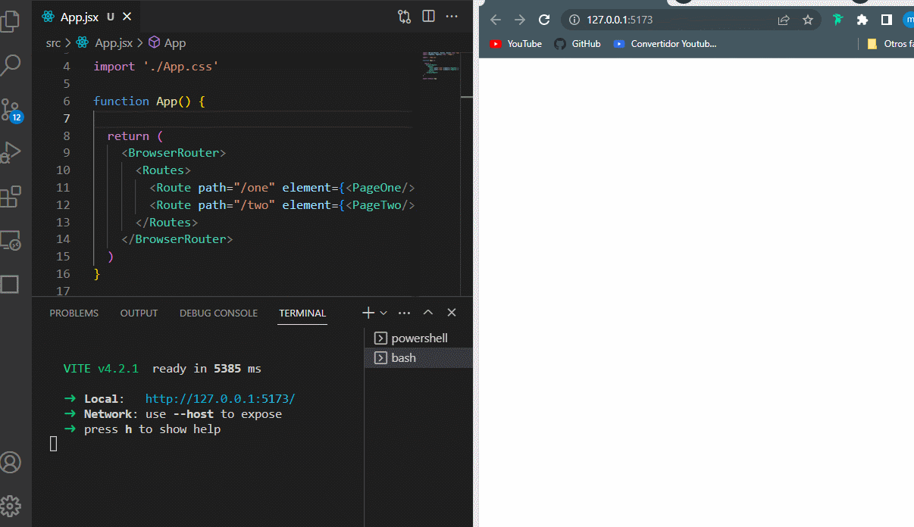
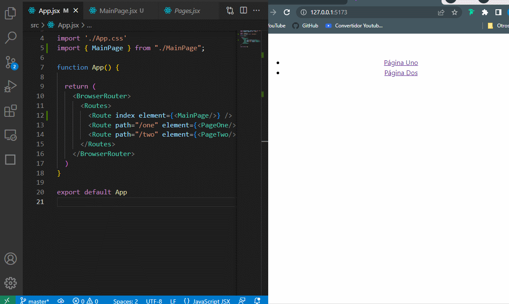

# React Router :rocket:


## CONTENIDO

- [Instalación](#instalacion)
- [Configurar rutas](#configurar-rutas)


<a name="instalacion"></a>
## Instalación

```bash
npm install react-router-dom
```

<a name="configurar-rutas"></a>
## Configurar rutas

El enrutador o '**Router**' es un componente de nivel superior que hace que todos los demas componentes de navegación y *hooks* funcionen. React Router tiene **`BrowserRouter`** y **`HashRouter`** para aplicaciones web. En una aplicación se usa comúnmente **`<BrowserRouter>`** y este componente envuelve uno o más elementos **`<Routes>`**.  

**`<Routes>`** comprueba todos sus hijos (*`children`*) que son elementos **`<Route>`** para encontrar la mejor coincidencia y representar esa parte de la interfaz.  

**`<Route>`** se define como un objeto o un elemento de una ruta. Si es un objeto, el objeto tiene una forma de **`{path, element}`**. Si es un elemento de ruta, el componente tiene una forma de **`<Route path element>`**. Cuando el patrón de ruta coincide con la URL actual, se representará la propiedad **`element`**.  

Para ver como funciona, preparamos unas páginas de ejemplo:  

```jsx
// src/Pages.jsx
import {loremIpsum} from 'lorem-ipsum' // => npm i lorem-ipsum

const getPage = (index) => {
  return (
  	<>
  	  <h1>Página actual</h1>
  	    <section>
  	      <h3>Contenido de la página: {index}</h3>
  	      <p>{loremIpsum({count: 10})}</p>
  	    </section>
  	</>
  )
}

export const PageOne = () => getPage(1);
export const PageTwo = () => getPage(2);
```

En el bloque anterior creamos una función que genera una página con título donde el contenido de la página se genera con la función de `loremIpsum()` con 10 oraciones aleatorias y finalmente usamos la función `getPage` para generar `PageOne` y `PageTwo`.  
Ahora podemos importar y crear dos rutas para representar cada página:  


```jsx
import {BrowserRouter, Routes, Route} from "react-router-dom";
import {PageOne, PageTwo} from "./Pages";

export default function App() {
  return (
    <BrowserRouter>
  	  <Routes>
  	    <Route path="/one" element={<PageOne/>} />
  	    <Route path="/two" element={<PageTwo/>} />
  	  </Routes>
    </BrowserRouter>
  )
}
```

**`<BrowserRouter>`** y **`<Routes>`** se utilizan para definir el enrutador. Hay dos **`<Route>`** en la aplicación para cuando la URL coincide con la ruta "**one**" la aplicación mostrará **`<PageOne>`** cuando la URL coincide con la ruta "**two**" se muestra **`<PageTwo>`**.



Como vemos la aplicación funciona para las rutas **one** y **two**. Sin embargo '`http://localhost:<port>`' no muestra nada nada, al igual que cualquier URL no válida. Este problema en principio se puede resolver con una ruta comodín de la siguiente manera: **`<Route path="*" element={<PageOne/>}/>`**.  

> ***Nota:*** Dado que react Router v6 es lo suficientemente inteligente como para elgir la coincidencia más específica, el orden de la ruta no importa

## Configurar navegación de rutas

Las dos rutas de ejemplo anterior funcionan como se esperaba. Sin embargo no es conveniente escribir la URL en la barra de direcciones, sería mejor que nuestra aplicación sea capaz de navegar haciendo clic en los enlaces, que en React Router los podemos usar como un elemento **`<Link>`**.  

```jsx
// src/MainPage.jsx
import {Link} from "react-router-dom";

export const MainPage = () => (
  <nav>
    <ul>
      <li>
        <Link to="/one">Página uno</Link>
      </li>
      <li>
        <Link to="/two">Página dos</Link>
      </li>
    </ul>
  </nav>
);
```

```jsx
// src/App.jsx
import {MainPage} from "./MainPage";

export default function App() {
  <BrowserRouter>
    <Routes>
      <Route index element={<MainPage/>} />
      <Route path="/one" element={<PageOne/>} />
      <Route path="/two" element={<PageTwo/>} />
    </Routes>
  </BrowserRouter>
}
```

Ahora tenemos una nevegación muy básica con dos enlaces que nos llevará a las rutas definidas. Sin embargo dentro de **`PageOne`** y **`PageTwo`**, no podemos usar los enlaces para navegar ya que no aparecen como se muestra a continuación:  




Para resolver este problema, crearemos un componente `<Outlet>`


