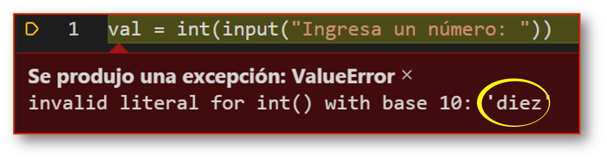

<h1 align="center">
 
 <br><br>
<code>input()</code>
</h1>

Los desarrolladores a menudo tenemos la necesidad de interactuar con los usuarios, ya sea para obtener datos o para proporcionar algún tipo de resultado. La mayoría de los programas actuales utilizan un cuadro de diálogo como una forma de pedirle al usuario que proporcione algún tipo de entrada (*input*). Mientras que Python nos proporciona dos funciones incorporadas para leer la entrada estándar desde el teclado.

**Sintaxis**

```py
input([prompt]) # Para Python en su versión 3.x
raw_input([prompt]) # Para Python en su versión 2.x
```


> **prompt**: es un argumento opcional recibe una cadena de texto para mostrar al usuario.


Esta función **input()** primero toma la entrada del usuario y luego se evalúa la expresión, lo que significa que Python identifica automáticamente si el usuario ingresó una cadena, un número o una lista. Si la entrada proporcionada no es correcta, Python genera un error de sintaxis o una excepción como [**_`ValueError`_**](https://docs.python.org/3/library/exceptions.html#ValueError). 

Por ejemplo:

```py
val = input("Ingresa un valor: ")
print(val)
# Ingresa un valor :  10
# output: 10 
# por defecto lo almacena como una cadena
print(type(val))
# <class 'str'>
```

Usando la conversión de tipos, si convierte explícitamente una variable que contiene a la función **input()** o utilizandola directamente en su declaración y si el usuario ingresa un valor erróneo tendría una excepción de tipo [**_`ValueError`_**](https://docs.python.org/3/library/exceptions.html#ValueError):

```py
val = int(input("Ingresa un número: "))
# o también ocurrirá un error si lo tengo de la siguiente manera
# print(int(val))
print(val)
# Ingresa un valor :  diez
# output: ValueError: invalid literal for int() with base 10: 'diez'
```
<p align="center">
    
</p>


## Como funciona internante input() en Python

- Primero se ejecuta la función `input()`, el flujo del programa se detendrá hasta que el usuario haya dado la entrada.

- El texto o mensaje que se ingreso a la opción `prompt` muestra en la pantalla de salida para pedirle al usuario que ingrese un valor de entrada (opcional).

- Lo que sea que ingrese como entrada, la función `input()` lo convierte en una cadena, quiere decir, si ingresa un valor entero, será procesado como una cadena, necesitará convertirlo explícitamente en un número entero en su código usando la **conversión de tipo** Ej: 

```py
num = input("Ingrese un número: ")
print(type(num))
# output: <class 'str'>
num = int(input("Ingrese un número: "))
print(type(num))
# output: <class 'int'>
# otra opción más legible es:
num = input("Ingrese un número: ")
print(type(int(num)))
```

## Tomando múltiples entradas del usuario en Python

En Python se pueden tomar múltiples valores o entradas en una línea mediante dos métodos:

- usando el método **split()**
- usando la comprensión de lista (*list comprehension*)

## Usando el método split()

Esta función ayuda obtener múltiples entradas de los usuarios rompe la entrada dada por el separador, cualquier espacio en blanco es un separador. Generalmente, los desarrolladores usan el método **split()** para dividir una cadena de Python, pero se puede usar para tomar múltiples entradas. 


**Sintaxis**: 

```py
input().split(separator, maxplit)
```

Ejemplos: 

```py
x, y = input('Ingresa dos valores: ').split()
print('Eje x:', x)
print('Eje y:', y)
# ======== Otra forma
a, b = input('Ingresa dos valores: ').split()
print('Primer número {} y segundo número es {}'.format(a, b))
```

<p align="center">
 <a href="https://colab.research.google.com/drive/1Xii73KEHvw8y9Utu1KlSH8FGWfrPaSO8?usp=sharing">
  <br></a> 
</p>


## Usando la comprensión de listas

Las comprensión de lista (*list comprehension*) es una forma elegante de definir y crear listas en Python. Podemos crear listas como enunciado matemáticos en una sola línea. También se utiliza para obtener múltiples entradas de un usuario.

**Sintaxis**:

```
[expression for variable in collection if condition]
```

A menudo la expresión (es decir, aquello que terminará inserto en la lista resultante) es igual a la variable, la condición es opcional. La colección puede ser una lista o cualquier otro objeto iterable (esto es, cualquier cosa sobre lo que podamos aplicar un bucle `for`).

Ejemplo: 

```py
x, y = [int(x) for x in input("Ingresa dos valores: ").split()]
print('Eje x:', x)
print('Eje y:', y)
```

> **Nota**: Los ejemplos anteriores tomando entradas separadas por espacios, en caso que nuestro deseo sea tomar entradas separadas por comas(,) podemos hacerlo de la siguiente manera.

```py
x = [int(x) for x in input("Ingrese múltiples valores separados por coma: ").split(",")]
print("Numeros de la lista: ", x)
```


## Complementando para ocultar la información de entrada


Otro aspecto que es importante son las contraseñas al momento de manejar entradas, debemos buscar la manera segura de ingresar esta información. Python propociona la función **getpass()** del módulo con el mismo nombre. Le solicita al usuario una contraseña sin hacer eco. El módulo **getpass** proporciona una forma segura de manejar las solicitudes de contraseña donde los programas interactúan con los usuarios a través del terminal. Este módulo proporciona dos funciones:


1. **getpass.getpass()**
2. **getpass.getuser()**


La función **getpass()** se utiliza para solicitar a los usuarios que utilicen la solicitud de cadena y lee la entrada del usuario como Contraseña. La lectura de entrada predeterminada es "Password: " se devuelve a la persona que llama como una cadena.

**Sintaxis**: 

```
getpass.getpass(prompt='Password: ', stream=None) 
```

Veamos el siguiente ejemplo para comprender su implementación.

```py
# Ejemplo 1: Sin argumentos en la llamada.
import getpass
 
try:
    p = getpass.getpass()
    
except Exception as error:
    print('ERROR', error)
else:
    print('Contraseña ingresada: ', p)
# Entrada del usuario:
# Password : (No se muestra lo que se escribe.)
# output: Contraseña ingresada: salchipapa123
```

Al no proporcionar una cadena como argumento se imprime el valor **password:** para mostrar al usuario es el valor por defecto que tiene la función. Hay ciertos programas que solicitan preguntas de seguridad en lugar de solicitar contraseñas para mejorar la seguridad. Aquí, la solicitud se puede cambiar a cualquier valor. 


```py
# Ejemplo 2: cambiamos la pregunta
import getpass
 
p = getpass.getpass(prompt='¿Cuál es tu color favorito? ')
 
if p.lower() == 'azul':
    print('Bienvenido..!!!')
else:
    print('La respuesta ingresada es incorrecta..!!!')
# Entrada: ¿Cuál es tu color favorito? Azul
# output: Bienvenido
```

La función **getuser()** muestra el nombre de inicio de sesión del usuario. Esta función verifica las variables de entorno **`LOGNAME`**, **`USER`**, **`LNAME`** y **`USERNAME`**, en orden, y devuelve el valor de la primera cadena no vacía. 

**Sintaxis**: 

```
getpass.getuser()
```

Veamos el siguiente ejemplo para comprender su implementación.

```py
#Ejemplo 3: Mostrando el usuario 
import getpass
 
user = getpass.getuser()
 
while True:
    pwd = getpass.getpass("Usuario : %s " % user)
 
    if pwd == 'abcd123':
        print "Bienvenido!!!"
        break
    else:
        print "La contraseña es incorrecta."
# Entrada : Usuario: Will 
```

<p align="center">
<a href="https://colab.research.google.com/drive/1Xii73KEHvw8y9Utu1KlSH8FGWfrPaSO8?usp=sharing#scrollTo=_8VwvC5fSO7k">
  <br></a> 
</p>

