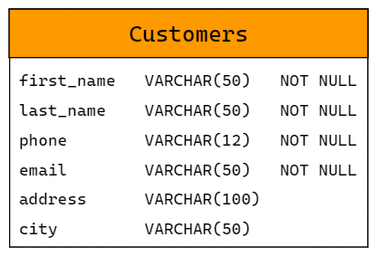

[comment]: <> (Author: Marco Contreras Herrera)
[comment]: <> (Email: enidev911@gmail.com)

## CRUD


<picture>
  <source media="(prefers-color-scheme: dark)" srcset="https://user-images.githubusercontent.com/25423296/163456776-7f95b81a-f1ed-45f7-b7ab-8fa810d529fa.png" width="30">
  <source media="(prefers-color-scheme: light)" srcset="https://user-images.githubusercontent.com/25423296/163456779-a8556205-d0a5-45e2-ac17-42d089e3c3f8.png" width="30">
  
</picture>

## CONTENIDO

- [Crear una clase para Clientes](#crear-clase)
- [Trabajando con SQLite](#trabajando-con-sqlite)
- [Insertando datos en la tabla](#insert-table)
- [Consultar datos en la tabla](#obtener-los-registros)
- [Utilizando la clase Cliente creada](#utilizando-clase-cliente)
- [Crear prototipo de las funciones CRUD](#crud-operations)


<a href="#crear-clase"></a>
### Crear una clase cliente

Antes de sumergirnos en el ejemplo **CRUD** con **Python** y **SQLite**, digamos que queremos crear una aplicación que maneje los datos del cliente. La aplicación creada debe tener la funcionalidad para crear, actualizar, leer y eliminar clientes. Tenemos que guardar esos datos del cliente en una base de datos, para ello debemos tener una estructura definida de un cliente y asi podamos realizar las operaciones CRUD anteriores desde la base de datos. 

Primero que nada, creemos una clase de Cliente en un archivo nombrado **customer.py**  

```py
# customer.py

class Customer:

    def __init__(self, first_name, last_name, phone, address, city):
        self.first_name = first_name
        self.last_name = last_name
        self.phone = phone
        self.address = address
        self.city = city

    @property
    def email(self):
        return '{}.{}@gmail.com'.format(self.first_name, self.last_name)


    @property
    def fullname(self):
        return '{} {}'.format(self.first_name, self.last_name)
    
    def __repr__(self):
        return "Customer('{}', '{}', '{}', '{}', '{}')".format(
            self.first_name,
            self.last_name,
            self.phone,
            self.address,
            self.city)
```

`@property` es un decorador incorporado para el uso de captadores y definidores en Python orientado a objetos. He definido dos métodos para el correo electrónico del cliente y el nombre completo del cliente y los marqué como decoradores. Usando el método, puedo obtener la representación del objeto real de la clase de cliente (\_\_repre\_\_).


---

<a name="trabajando-con-sqlite"></a>
### Trabajando con SQLite

Creamos un archivo **crud.py** para ir viendo las operaciones del **CRUD** con Python con SQLite . Toda la funcionalidad relacionada con la base de datos va aquí. En primer lugar, tenemos que importar la biblioteca estándar SQLite3 a nuestro código para que podamos trabajar con las operaciones de la base de datos.

<a href="crear-una-conexion"></a>
### Crear una nueva conexión

Necesitamos crear un objeto de conexión para representar nuestra base de datos. En este caso, nuestra base de datos tendrá el nombre de **customer.db** y usando el método **`connect()`** podemos pasar un la ubicación de un archivo y si no existe lo crea. También podemos hacer una base de datos en memoria. 


Este ejemplo muestra una base de datos en memoria:  

```py
import sqlite3

connection = sqlite3.connect(':memory:')
```

Ahora veamos un ejemplo para una conexión a base de datos **customer.db**:  

```py
import sqlite3

connection = sqlite3.connect('customer.db')
```

Si ejecutamos este código, creará un archivo **customer.db** en nuestro directorio. Incluso si el archivo ya existía. no obtendremos errores la próxima vez que ejecutemos el mismo código.  


<a name="crear-un-cursor"></a>
### Crear un objeto Cursor

Un cursor nos permite interactuar con la base de datos a través de comandos SQL, podemos crear un cursor llamando al método **`.cursor()`** de nuestro objeto de conexión.  

```py
import sqlite3

connection = sqlite3.connect('customer.db')
cursor = connection.cursor()
```

Con el objeto cursor ahora podemos llamar al método **`.execute()`** para ejecutar comandos SQL.


<a name="crear-tabla"></a>
### Creando la tabla de clientes

Usando el cursor, vamos a crear una tabla de clientes. Tendrá los siguientes campos (columnas):  




El comando **SQL** que queremos ejecutar entrará en el método **execute()** del objeto cursor. Utilizando comillas triples para envolver el comando SQL. Utilizaremos los "[docstring](https://peps.python.org/pep-0257/)" para escribir valores de cadena en varias líneas.  

```py
## sqlite_demo.py
import sqlite3

connection = sqlite3.connect('customer.db')

cursor = connection.cursor()

cursor.execute("""
    CREATE TABLE IF NOT EXISTS customers(
        first_name VARCHAR(50) NOT NULL,
        last_name VARCHAR(50) NOT NULL,
        phone VARCHAR(12) NOT NULL,
        email VARCHAR(50) NOT NULL,
        address VARCHAR(100),
        city VARCHAR(50))
    """)

connection.commit()
connection.close()
```

Ahora si ejecutamos nuestro script **'crud.py'**

```bash
python crud.py
```

Si no obtenemos ningún error, eso significa que hemos creado la tabla de clientes correctamente.  

Si vuelve a ejecutar el mismo código, obtendríamos un error de que ya existe la tabla en la base de datos. Es por ello que le agregamos la cláusula `IF NOT EXISTS`.  


<a name="insertar-en-tabla"></a>
### Insertar datos en la tabla de clientes


Ahora que ya hemos creado la tabla de la base de datos, agreguemos datos a la tabla de clientes. Para eso podemos usar el comando SQL "`INSERT INTO table_name VALUES(val, val2, ...)`".   


```py
## crud.py
import sqlite3

connection = sqlite3.connect('customer.db')

cursor = connection.cursor()

cursor.execute("""
    CREATE TABLE IF NOT EXISTS customers(
        first_name VARCHAR(50) NOT NULL,
        last_name VARCHAR(50) NOT NULL,
        phone VARCHAR(12) NOT NULL,
        email VARCHAR(50) NOT NULL,
        address VARCHAR(100),
        city VARCHAR(50))
    """)

cursor.execute("""
    INSERT INTO customers (first_name, last_name, phone, email, address, city) 
    VALUES
    ('marco', 'contreras', '+56984687949', 'marco_contreras@gmail.com', 'av. los mojo-jojos', 'townsville')
    """)


connection.commit()
connection.close()
```

Ahora si ejecutamos nuevamente nuestro script y no obtenemos ningún error, eso significa que hemos creado la tabla de clientes correctamente y además hemos insertado un nuevo registro. Para verlo podemos abrir el archivo con un programa como [DbBrowser](https://sqlitebrowser.org/):  

[](./assets/open_db_in_dbbrowser.png)

Después de revisar la base de datos, asegúrese de comentar las líneas de código del **`INSERT INTO`**, de lo contrario cada vez que ejecutemos el script se llevará a cabo la inserción de la misma información. 


<a name="obtener-los-registros"></a>
## Consultar la tabla desde Python

Ahora podemos consultar la tabla sin ningún programa externo. En el método **execute()** usaremos el comando "**SELECT**":  

```py
## crud.py
import sqlite3

connection = sqlite3.connect('customer.db')

cursor = connection.cursor()

cursor.execute("""
    CREATE TABLE IF NOT EXISTS customers(
        first_name VARCHAR(50) NOT NULL,
        last_name VARCHAR(50) NOT NULL,
        phone VARCHAR(12) NOT NULL,
        email VARCHAR(50) NOT NULL,
        address VARCHAR(100),
        city VARCHAR(50))
    """)


# Comentamos este bloque para no se inserte nuevamente
# ====================================================
# cursor.execute("""
#     INSERT INTO customers (first_name, last_name, phone, email, address, city) 
#     VALUES
#     ('marco', 'contreras', '+56984687949', 'marco_contreras@gmail.com', 'av. los mojo-jojos', 'townsville')
#     """)


cursor.execute("SELECT * FROM customers")
print(cursor.fetchall())

connection.commit()
connection.close()
```

Después del método **`execute()`**, obtendremos un resultado de consulta para que podamos iterar para encontrar el resultado deseado. hay algunos métodos diferentes para iterar el resultado de la consulta. 


|Método|Funcionalidad|
|------|-------------|
|`fetchone()`|obtendrá la siguiente fila en nuestro resultado y devolverá un registro. Si no hay más registro disponibles, devuelve None.|
|`fetchmany(number)`|fetchmany(number) devolverá un número especificado de filas como una lista. Si no hay más registro disponibles, devuelve una lista vacía.|
|`fetchall()`|devolverá las filas restantes como una lista que queda. Si no hay filas, devolverá una lista vacía.|


---

<a name="utilizando-clase-cliente"></a>
## Utilizando la clase de cliente


Primero, importamos la clase de cliente al archivo **Customer.py**. Ahora, tenemos que crear instancias de la clase de cliente. Crearemos dos instancias y las nombraremos como **customer1** y **customer2**:  


```py
import sqlite3
from customer import Customer

connection = sqlite3.connect('customer.db')

cursor = connection.cursor()

cursor.execute("""
    CREATE TABLE IF NOT EXISTS customers(
        first_name VARCHAR(50) NOT NULL,
        last_name VARCHAR(50) NOT NULL,
        phone VARCHAR(12) NOT NULL,
        email VARCHAR(50) NOT NULL,
        address VARCHAR(100),
        city VARCHAR(50))
    """)

customer_1 = Customer('marco', 'contreras', '+569-84687949', 'av suecia 327', 'coquimbo')
customer_2 = Customer('marcelo', 'riveros', '+569-89587949', 'av dinamarca 387', 'santiago')
```

Por ejemplo, digamos que quiero guardar los valores del objeto **customer_1** en la base de datos. Si usamos el fomato de cadena, podemos utilizar las llaves como marcadores de posición. Luego usando el método **`format()`**, completará esos valores en el marcador de posición correspondiente. 


```py
import sqlite3
from customer import Customer

connection = sqlite3.connect('customer.db')

cursor = connection.cursor()

cursor.execute("""
    CREATE TABLE IF NOT EXISTS customers(
        first_name VARCHAR(50) NOT NULL,
        last_name VARCHAR(50) NOT NULL,
        phone VARCHAR(12) NOT NULL,
        email VARCHAR(50) NOT NULL,
        address VARCHAR(100),
        city VARCHAR(50))
    """)

customer_1 = Customer('marco', 'contreras', '+569-84687949', 'av suecia 327', 'coquimbo')
customer_2 = Customer('marcelo', 'riveros', '+569-89587949', 'av dinamarca 387', 'santiago')

cursor.execute("INSERT INTO customers VALUES ('{}', '{}', {}, '{}', '{}', '{}')".format(
    customer_1.first_name,
    customer_1.last_name,
    customer_1.phone,
    customer1.email, 
    customer_1.city,
    customer_1.country))

connection.commit()
connection.close()
```

Como podemos observar no fue necesario pasar el **email** al momento de instanciar la clase, ya que este campo podemos obtenerlo desde el método **email** de la clase que creamos y lo podemos usar como una propiedad gracias al decorador **@property**  

>**Nota:** utilizar el formato de cadena no es buena práctica ya que se considera muy propenso a la inyección de SQL.  


### Forma adecuada de agregar un objeto a la base de datos

Hay dos formas de insertar objetos en una base de datos correctamente. Dado que el enfoque de formato de cadena es propenso a la inyección SQL, es mejor usar cualquiera de los siguientes métodos.  

1. Paramstyle que ofrece la [DB-API](https://peps.python.org/pep-0249/#paramstyle) colocando el símbolo `?`


```py
# import statements
# create connection object
# create database table

customer_1 = Customer('marco', 'contreras', '+569-84687949', 'av suecia 327', 'coquimbo')

cursor.execute("INSERT INTO customers VALUES (?,?,?,?,?,?)",
            (customer_1.first_name, customer_1.last_name,
             customer_1.phone, customer_1.email,
             customer_1.address, customer_1.city))
connection.commit()
```

Una cosa a tener en cuenta aquí, ya no usamos la función **`format()`**. En el método de ejecución, pase el segundo argumento como la tupla de valores de objeto que queremos guardar en la base de datos.  

Veamos otro método para lograr la misma funcionalidad que antes.  

---

2. Marcador de posición de DB-API a través de claves y valores de diccionario.  

En lugar de usar los "**`?`**" como marcador de posición, usamos los dos puntos "**`:`**" con un nombre que describe el marcador de posición. En el método de ejecución, tenemos que pasar un diccionario como segundo argumento. Las claves del diccionario serán los nombres de los marcasdores de posición y los valores serán los que pasamos de los atributos del objeto. Ej:  

|Marcador|par clave/valor|
|--------|---------------|
|:first|\{'first': customer_1.first_name}|

Usamos corchetes para denotar un diccionario.  


```py
# import statements
# create connection object
# create database table

customer_1 = Customer('marco', 'contreras', '+569-84687949', 'av suecia 327', 'coquimbo')

cursor.execute("INSERT INTO customers VALUES (:first, :last, :phone, :email, :city, :country)", 
{
    'first':customer_1.first_name, 
    'last':customer_1.last_name, 
    'phone':customer_1.phone,
    'email':customer_1.email,
    'address': customer_1.address,
    'city': customer_1.city 
})

connection.commit()
connection.close()
```

---

<a name="crud-operations"></a>
## Crear un prototipo de las funciones CRUD con la clase Customer

Para demostrar el ejemplo de Python y SQLite para un CRUD, crearé cuatro funciones en el archivo **crud.py**.


1. `create_customer(customer)`
2. `get_customers(city)`
3. `update_city(customer, city)`
4. `delete_customer(customer)`


Las funciones anteriores son sencillas y hacen lo que han definido.  

>**Nota:** A veces es tedioso comprometer nuestras posibilidades cuando hemos realizado las operaciones CRUD en la base de datos. Una forma sencilla de resolver ese problema es utilizar los administradores de contexto de Python. Los administradores de contexto se utilizan para configurar y eliminar recursos automáticamente. Por ejemplo; el objeto de conexión se puede utilizar como administrador de contexto para confirmar y deshacer transacciones automáticamente.  

La palabra clave **[`with`](https://realpython.com/python-with-statement/)** se utiliza para definir un administrador de contexto. Los administradores de contexto se pueden escribir usando clases o funciones con la ayuda de decoradores.  


### Función para crear nuevos clientes


La función `create_customer(customer)` guardará un registro de cliente en la base de datos.  

```py
# import statements
# create connection object
# create database table

def create_customer(customer):
    with connection:
        cursor.execute("INSERT INTO customer VALUES(:first,:last,:phone, :email, :address, :city)",
            {
                'first': customer.first_name,
                'last':customer.last_name,
                'email':customer.email,
                'address':customer.address,
                'city':customer.city
            })
```


En el código anterior, el método **`execute()`** del cursor se envuelve dentro del bloque **`with`**. para que no necesitemos una declaración **`commit()`** después de eso.  


### Función para obtener a los clientes


La función `get_customers(city)` aceptará la ciudad del cliente y devolverá un conjunto de resultados.  

```py
# import statements
# create connection object
# create database table

def get_customers(city):
    cursor.execute("SELECT * FROM customer WHERE city=:city", {'city':city})
    return cursor.fetchall()
```

**Nota:** es posible que se pregunte por qué no hay ningún bloque **`with`** aquí. Bueno, para la consulta **`SELECT`** no necesitamos la función **`commit()`**. Debido a que no necesita estar dentro de un administrador de contexto, pero si en el caso **INSERTAR**, **ACTUALIZAR**, **ELIMINAR**, entonces necesitamos un bloque **`with`**.  


**update_customers(**customer, city**)**  

La ciudad del cliente se actualizará según el nombre y apellido del cliente proporcionado.  

```py
# import statements
# create connection object
# create database table

def update_city(customer, city):
    with connection:
        cursor.execute("""UPDATE customer SET city=:city
            WHERE first_name=:first AND last_name=:last""",
            {'first': customer.first_name, 'last': customer.last_name,
             'city':city})
```


**delete_customers(**customer**)**  

Si el nombre y apellido del cliente dado coinciden con los registros existentes de la base de datos, todos los registros con ese nombre se eliminarán de la base de datos.  

```py
# import statements
# create connection object
# create database table

def delete_city(customer):
    with connection:
        cursor.execute("""DELETE FROM customer
            WHERE first_name=:first AND last_name=:last""",
            {'first': customer.first_name, 'last': customer.last_name})
```

Muy bien, hemos implementado toda la funcionalidad CRUD. Ahora ejecutemos nuestro código para ver el resultado.  


Primero que nada, necesitamos crear objetos customer. Crearemos algunos objetos de prueba.  

Luego insertar los clientes en la base de datos usando el método **create_customer(customer)**. Invocamos la función dos veces.  


```py
# import statements
# create connection object
# create database table

def create_customer(customer):
    with connection:
        cursor.execute("INSERT INTO customer VALUES (:first, :last, :age, :city, :country)", 
        {'first':customer.first_name, 'last':customer.last_name,
         'age':customer.age, 'city':customer.city, 'country':customer.country})

def get_customers(city):
    cursor.execute("SELECT * FROM customer WHERE city=:city", {'city':city})
    return cursor.fetchall()

customer_1 = Customer('john', 'doe', 30, 'perth', 'Australia')
customer_2 = Customer('sara', 'migel', 25, 'perth', 'Australia')

create_customer(customer_1)
create_customer(customer_2)

customers = get_customers('perth')

print(customers)

connection.close()
```
Ahora veamos cómo actualizar un cliente y eliminarlo. Tienes que usar las funciones *update_city(customer,city)* y *delete_customer(customer)* para eso.  

```py
# import statements
# create connection object
# create database table

def create_customer(customer):
    with connection:
        cursor.execute("INSERT INTO customer VALUES (:first, :last, :age, :city, :country)", 
        {'first':customer.first_name, 'last':customer.last_name,
         'age':customer.age, 'city':customer.city, 'country':customer.country})
    

def get_customers(city):
    cursor.execute("SELECT * FROM customer WHERE city=:city", {'city':city})
    return cursor.fetchall()

def update_city(customer, city):
    with connection:
        cursor.execute("""UPDATE customer SET city=:city 
        WHERE first_name=:first AND last_name=:last""",
        {'first':customer.first_name, 'last':customer.last_name, 'city':city})

def delete_customer(customer):
    with connection:
        cursor.execute("DELETE FROM customer WHERE first_name=:first AND last_name=:last",
        {'first':customer.first_name,'last':customer.last_name})

customer_1 = Customer('john', 'doe', 30, 'perth', 'Australia')
customer_2 = Customer('sara', 'migel', 25, 'perth', 'Australia')

create_customer(customer_1)
create_customer(customer_2)

update_city(customer_1,'sydney')

delete_customer(customer_2)

print(get_customers('perth'))
print(get_customers('sydney'))

connection.close()
```


    


