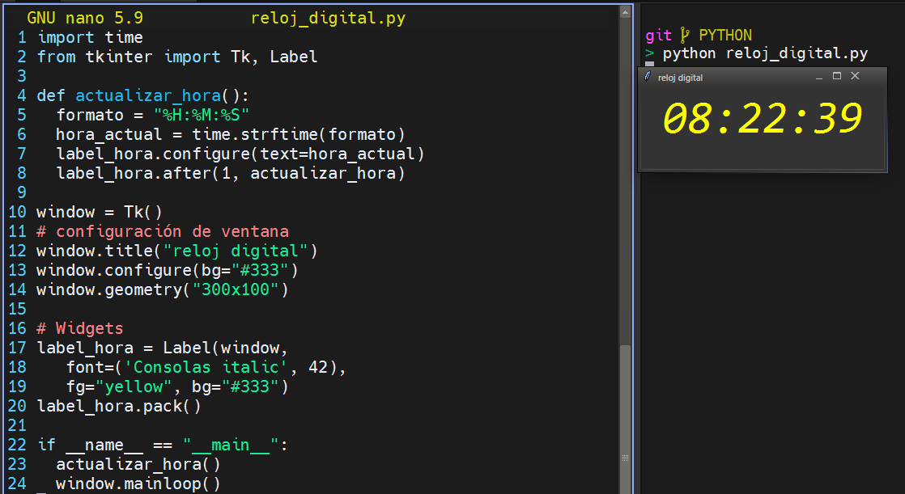

## Reloj Digital

El módulo **time** proporciona una variedad de formas de obtener la hora actual. Usaremos la función **strftime()** para analizar la hora actual en el formato: **hora:minutos:segundos**.

```py
import time

time.strftime("%H:%M:%S")
```
Con esto, podemos crear una función que se encarge de actualizar la hora, y usando el método **`after()`** de los **widgets** podemos llamar a esta misma función cada segundo:

```py
def actualizar_hora():
  formato = "%H:%M:%S"
  hora_actual = time.strftime(formato)
  label_hora.configure(text=hora_actual)
  label_hora.after(1, actualizar_hora)
```

Ahora podemos construir la ventana gráfica y ejecutar la función que actualiza la hora:

```py
import time
from tkinter import Tk, Label

def actualizar_hora():
  formato = "%H:%M:%S"
  hora_actual = time.strftime(formato)
  label_hora.configure(text=hora_actual)
  label_hora.after(1, actualizar_hora)

window = Tk()
window.title("reloj digital")
# configuración de ventana
window.geometry("300x100")

label_hora = Label(window,
   font=('Consolas italic', 42),
   fg="yellow", bg="#333")
label_hora.pack()

if __name__ == "__main__":
  ## Interfaz
  actualizar_hora()
  window.mainloop()
```

