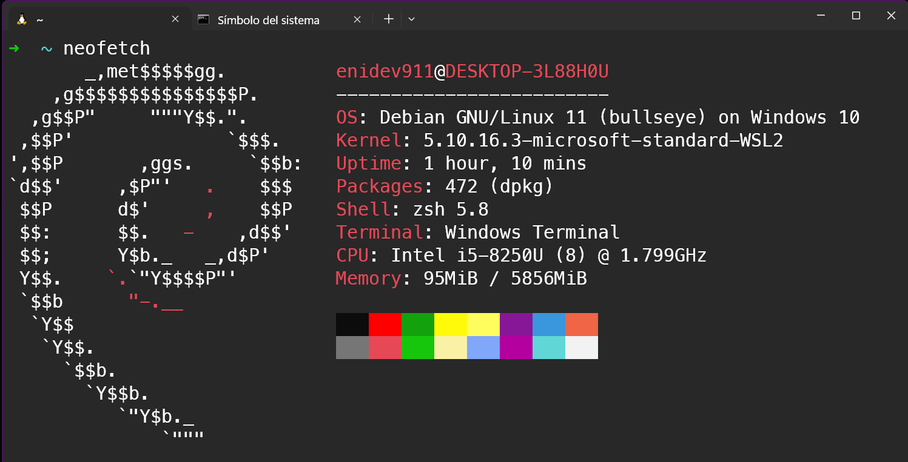
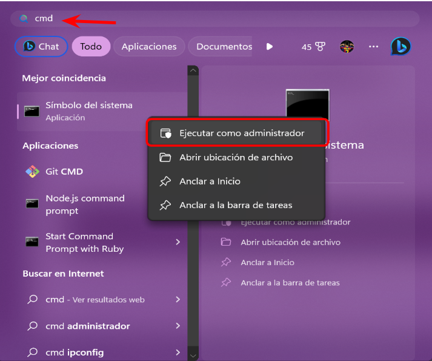
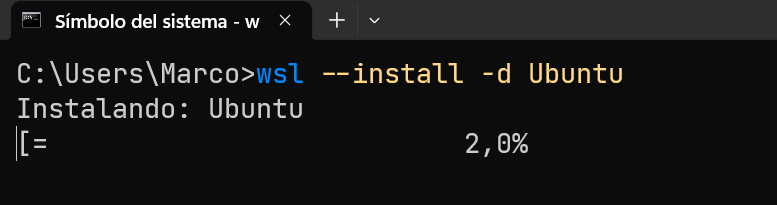
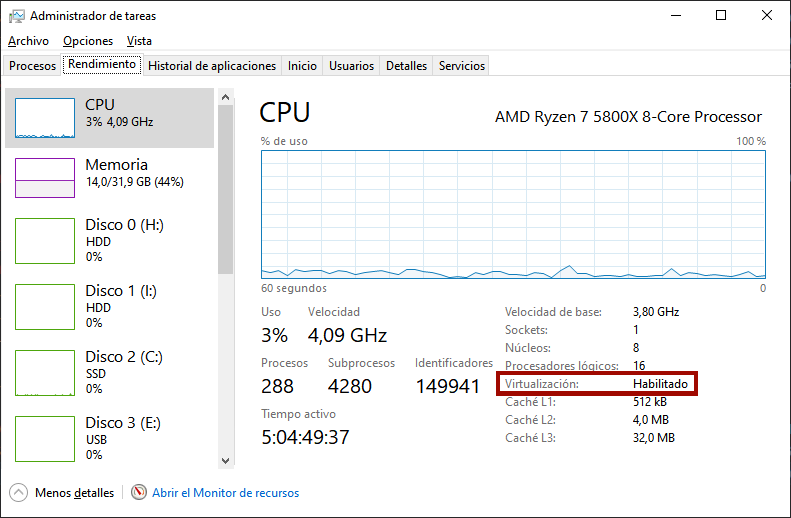
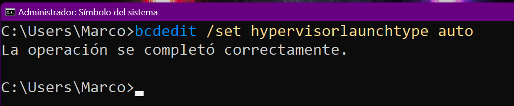
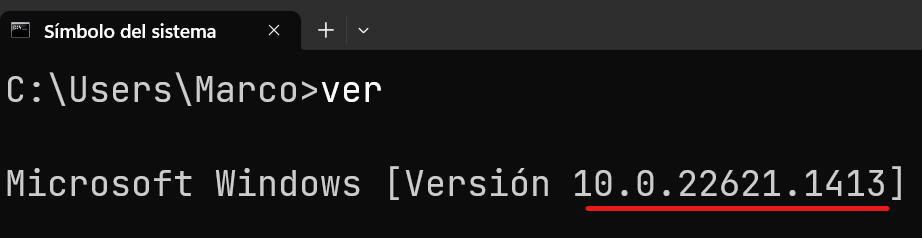
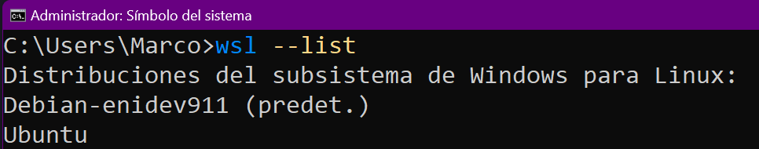
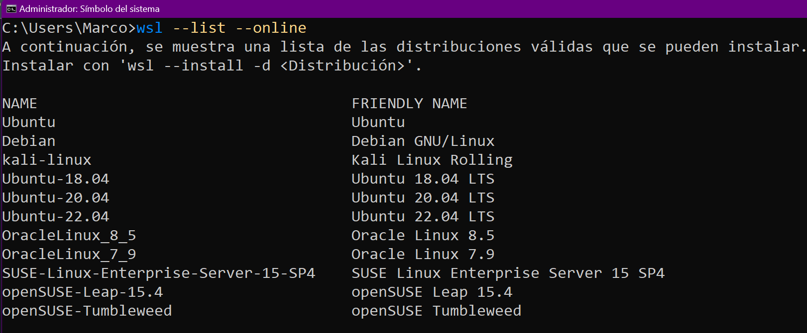

## INSTALACIÓN WSL

<br>

## CONTENIDO

- [Que es WSL](#que-es-wsl)
- [Requisitos previos](#requisitos)
- [instalacion automática](#instalacion-automatica)
- [instalacion manual](#instalacion-manual)
  - [Comprobar Hyper-v](#virtualizacion-hyper-v)
  - [Habilitar características](#activacion-caracteristicas)
  - [Ver Distros WSL](#distros-wsl)
  - [Distribuciones disponibles](#distros-disponibles)

<a name="que-es-wsl"></a>

## ¿Qué es WSL?

Ahora es posible utilizar distribuciones de **GNU/Linux** como [**Ubuntu**](https://ubuntu.com/) o [**Debian**](https://www.debian.org/index.es.html) dentro de nuestro sistema con **Windows**, dandonos la posibilidad de poder usar la mayoría de sus aplicaciones de **GNU/Linux**, [incluso algunas que tienen entorno gráfico](https://learn.microsoft.com/es-es/windows/wsl/tutorials/gui-apps) y además la integración con aplicaciones de **Windows** y asi ofrecernos una experiencia de escritorio sin problemas.

En la siguiente captura tenemos un sistema **GNU/Linux** Debian dentro de Windows, a través de [**Windows Terminal**](https://apps.microsoft.com/store/detail/windows-terminal/9N0DX20HK701).



Otros sistemas operativos como **GNU/Linux** o **Mac**, disponen de una interfaz de línea de comandos, por lo que hasta el momento era bastante complejo tener compatibilidad entre otros sistemas y Windows. Con la adopción de **WSL** en Windows, Microsoft introduce una capa intermedia que funciona como un **núcleo de linux real** (_kernel_) y en el se pueden instalar algunas distribuciones de **GNU/Linux** (_desde la tienda oficial de Microsoft o de forma manual_) como por ejemplo [**Ubuntu**](https://apps.microsoft.com/store/detail/9NBLGGH4MSV6?hl=es-es&gl=ES), **Debian**, **Kali** o incluso la distribución minimalista **Alpine**.

<a name="requisitos"></a>

## Requisitos previos

Para poder disponer de una terminal de **GNU/Linux** en nuestro Windows, antes necesitaremos asegurarnos que nuestro equipo cumple los siguientes requisitos:

- Necesitaremos tener **Windows 10 o superior** (_cualquier versión salvo Windows S_).

- La característica **Windows Subsystem for Linux** activada.
- La característica **Plataforma de Máquina virtual** activada.
- Se recomienda tener las **actualizaciones de Windows** al día para mayor compatibilidad.

> Recientemente, Microsoft ha añadido una forma automática de instalar **WSL**, por lo que se recomienda echarle primero un vistazo a esa instalación automática, y si no funciona, seguir con la instalación manual.

<a name="instalacion-automatica"></a>

## Instalación automática

Desplegamos el menu de **inicio** y escribimos **cmd**, pulsamos con el botón derecho y seleccionamos **Ejecutar como administrador**:

<p align="center">
	
</p>

Cuando nos aparezca la terminal de texto, escribiremos lo siguiente:

```bash
wsl --install -d Ubuntu
```

<p align="center">
	
</p>

Una vez hecho esto, reiniciamos la computadora. Esto realizará los pasos necesarios para tener **WSL**:

- Habilitar las características opcionales necesarias.
- Descargar el último [**kernel de Linux**](https://es.wikipedia.org/wiki/N%C3%BAcleo_Linux).
- Establecer WSL2 como predeterminado.
- Instalar **Ubuntu** como distribución de Linux en WSL.

Ahora si este método ha funcionado correctamente, al ejecutar el comando `wsl --list` debería mostrarnos que tenemos una distribución Ubuntu instalada. En ese caso, puedes saltarte la siguiente sección de **Instalación manual** e ir directamente a [Instalación de distro](#instalacion-distro)

---

<a name="instalacion-manual"></a>

## Instalación manual

Si por alguna razón no nos funciona la [**instalación automática**](#instalacion-automatica) (_o no te sirve el comando `wsl --install -d Ubuntu`_) seguiremos algunos pasos para hacerlo manualmente.

<a name="virtualizacion-hyper-v"></a>

### Virtualización Hyper-V

En la Bios/UEFI del equipo, debemos tener activada la característica **Virtualización Hyper-V** o **Hyper-threading-virtualization**. Para comprobar si la tenemos activada, podemos pulsar la combinación de teclas: <kbd>CTRL</kbd> + <kbd>ALT</kbd> + <kbd>SUPR</kbd> y vamos al **Administrador de tareas**, a la pestaña **Rendimiento**. Si marcamos **CPU**, en las opciones inferiores podremos ver un texto que dice **Virtualización: Habilitado**:

<p align="center">
	
</p>

En ese caso, tenemos la virtualización **Hyper-V** activada en la Bios/UEFI y podemos saltar al siguiente punto. En caso contrario, quizás no se encuentre habilitada y debamos activarla en la BIOS. Dicha característica puede encontrar en un menú diferente, dependiendo de la marca y modelo de la placa de la computadora.

> Es posible activar esta característica desde el **Símbolo de sistema** de Windows como administrador, escribiendo el comando: `bcdedit /set hypervisorlaunchtype auto`. Para volver a desactivar, el comando sería: `bcdedit /set hypervisorlaunchtype off`  
> 

<a name="activacion-caracteristicas"></a>

### Activación de características

Por otro lado, para activar las características mencionadas anteriormente en Windows, accedemos al buscador de inicio y buscamos **Activar o desactivar características de Windows**, donde encontraremos un menú de selección para activar las casillas **Subsistema de Windows para Linux** y **Plataforma de máquina virtual**:

<p align="center">
	
</p>

La primera de ellas absolutamente necesaria, puesto que es el propio **WSL**. La segunda de ella es necesaria para utilizar **WSL2**, y **es posible que no aparezca si no tenemos Windows 10 actualizado**. Puedes comprobarlo, accediendo al símbolo de sistema y escribir en la terminal el comando `ver`:

<p align="center">
	
</p>

El comando **ver** nos mostrará la versión instalada de Windows 10. Si es igual o superior a **10.0.19041**, podremos utilizar **WSL2**, en caso contrario, es posible que no podamos utilizar WSL (o sólo podamos usar WSL1). Para solucionarlo, revisa las actualizaciones de Windows e instala las que tengas pendientes.

> **Nota:** También es posible comprobar que versión tenemos instalada pulsando <kbd>WIN</kbd>+<kbd>R</kbd> y escribiendo winver. Si tenemos la compilación de SO 19041 o superior, podremos utilizar WSL2.

<a name="distros-wsl"></a>

### ¿Qué distros tengo en WSL?

**Windows Subsystem for Linux** funciona de modo que podemos tener varias distribuciones instaladas en nuestro sistema y utilizar la que queramos. Una vez hecho los pasos anteriores, deberíamos disponer de un comando wsl.

Para ver que distribuciones tenemos instaladas, abrimos una terminal de Windows pulsando <kbd>Win</kbd>+<kbd>R</kbd> y escribiendo cmd. Luego, tecleamos el comando `wsl --list`:

<p align="center">
	
</p>

En el caso de tener alguna distribución de Linux instalada, nos aparecería el siguiente mensaje:

```txt
> wsl --list

El subsistema de Windows para Linux no tiene distribuciones instaladas.
Para instalar las distribuciones, se puede visitar Microsoft Store:
https://aka.ms/wslstore
```

> Si en lugar de aparecer el mensaje anterior nos muestra un error al no encontrar el comando wsl, es posible que no tengamos aún instalada la característica **Windows Subsystem for Linux** que mencionamos en el apartado anterior.

<a name="distros-disponibles"></a>

### Distribuciones Linux para WSL

**WSL** permite instalar una serie de distribuciones de Linux específicas, que podemos consultar escribiendo el comando `wsl --list --online`:

<p align="center">
	
</p>

> Recuerda que la forma automática de instalar una de estas distribuciones es escribiendo el comando `wsl --install -d <nombre-distro>`, y reemplazando **nombre-distro** por el nombre de la distribución deseada.

Ahora podemos seguir los pasos para terminar [La instalación de Ruby y Rails](https://gorails.com/setup/windows/10).
